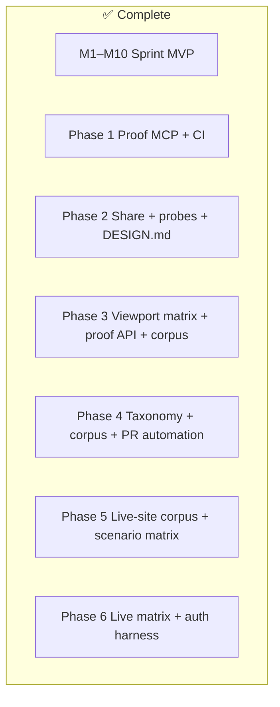

# Tell — Consolidated Plan

> **Single source of truth for remaining work.** All other plan docs either duplicate this,
> are historical specs, or are archived under `docs/archive/`.
>
> Engineering contracts: root [`BUILD.md`](./BUILD.md) (milestones M1–M10).  
> Product status snapshot: [`README.md`](./README.md) § Product Status.  
> Agent routing: [`ORCHESTRATION.md`](./ORCHESTRATION.md).

---

## Visual status



| Layer | Status | Authority |
|---|---|---|
| Sprint MVP M1–M10 | ✅ Done | `BUILD.md` §8 |
| Phase 1 (proof MCP, PR diagnose, golden fixture) | ✅ Done | README |
| Phase 2 (share links, state probes, DesignSystemDrift) | ✅ Done | README |
| Phase 3 (viewport matrix, `/api/proof/verify`, corpus manifest) | ✅ Done | PLAN.md |
| Phase 4 (taxonomy, more corpus, PR proof automation) | ✅ Done | PLAN.md |
| Phase 5 (live-site corpus + scenario matrix) | ✅ Done | PLAN.md |
| Phase 6 (live Playwright matrix + auth storageState harness) | ✅ Done | PLAN.md |
| Stretch cut earlier | ✅ Share links + state probes shipped | was `docs/04` §10 |

---

## Plan inventory (what to keep vs archive)

| Doc | Role | Action |
|---|---|---|
| **`PLAN.md` (this file)** | Consolidated remaining-work plan | **Keep — primary** |
| **`BUILD.md`** | Engineering contracts + M1–M10 DoD | **Keep — never archive** |
| **`ORCHESTRATION.md`** | Agent/model routing | **Keep** |
| **`USER_STORY.md`** | Priya north star / copy | **Keep** |
| **`README.md` Product Status** | Public shipped/next list | Keep in sync with this file |
| `docs/02_CURSOR_BUILD_INSTRUCTIONS.md` | Exact duplicate of `BUILD.md` | **Archived** → stub |
| `docs/04_CLAUDE_PROJECT.md` §12 tracker | Live tracker | Keep in sync |
| `docs/06_REDESIGN_ENGINE_V2.md` | Redesign v2 build spec | **Archived as shipped** → stub |
| `docs/01`, `03`, `05`, `06_TELL_PROOF`, `DEPLOY*` | Living specs / deploy | **Keep** (not plans) |
| `DESIGN.md`, `PITCH.md` | Dogfood contract / pitch | **Keep** |

---

## Phase 6 checklist (DoD) — closed

- [x] Auth harness: Playwright `storageState` via `CaptureUrlOptions` / `TELL_AUTH_STORAGE_STATE`
- [x] Fixture `/account` gate (`tell_session=authenticated`) + `pnpm auth:fixture`
- [x] Fixture `/pricing` route for multi-page demo drift
- [x] `captureScenarioMatrix` passes `authRole` through to `captureUrl`
- [x] Live capture CLI: `pnpm capture:matrix` (+ compact `liveScenarioPlan`)
- [x] CI: boot fixture, mint auth, live matrix capture + self-compare
- [x] MCP `tell_capture_matrix` + web `POST /api/proof/matrix` + Tell Report matrix panel
- [x] Web `/api/diagnose` uses `classifyWithTaste` when `GEMINI_API_KEY` is set (parity with MCP)
- [x] Tracker + README Product Status updated

---

## Phase 5 checklist (DoD) — closed

- [x] Schema: `CaptureScenario`, `ScenarioMatrix`, `ProofCellResult`, `ProofMatrixResult` in `@tell/schema`
- [x] Core: `captureScenarioMatrix` + `compareProofMatrices` (deterministic; zero LLM)
- [x] Detector: `ResponsiveViewportDrift` when mobile/tablet structure collapses vs desktop
- [x] Live-site-style corpus captures: `marketplace-clutter`, `docs-site-calm` (+ generator)
- [x] Committed scenario matrix fixture (`fixtures/corpus/scenario-matrix.json`) covering route × viewport × theme × interaction
- [x] Manifest + taxonomy + golden tests cover new captures, matrix cells, and D8 detector
- [x] `pnpm proof:matrix` smoke + CI step on UI/engine PRs
- [x] Docs: `PLAN.md` closed, README Product Status, `docs/06_TELL_PROOF.md`, tracker §12

---

## Phase 4 checklist (DoD) — closed

- [x] Machine-readable open taxonomy at `fixtures/corpus/taxonomy.json` (+ README)
- [x] Additional corpus captures: `editorial-calm` (0 tells), `fintech-dense` (dense drift profile)
- [x] Manifest + golden tests cover new categories
- [x] GitHub workflow / script for proof-compare on UI PRs
- [x] Cursor after-edit hook reminds agents to run proof-verify on UI changes
- [x] Tracker + README Product Status updated; redundant plans archived

---

## Goal prompt (paste into Composer / Cloud Agent)

```
@PLAN.md @BUILD.md @USER_STORY.md @ORCHESTRATION.md @README.md @docs/06_TELL_PROOF.md

GOAL: Keep Phase 6 green — live Playwright scenario matrix + auth storageState harness
remain end-to-end usable (CLI, CI, MCP, web panel) with zero open PLAN checklist items.

Non-negotiables:
- Deterministic core (packages/core) has zero LLM calls
- Never auto-apply patches; proof verify may apply only in disposable checkout
- Schemas via @tell/schema at every boundary
- pnpm test + schema build + web typecheck must stay green
- Preserve offline fixture fallback (fixtures/reports/tell-report.json)
- Auth uses disposable Playwright storageState — do not build product login/OAuth

Done when PLAN.md Phase 6 checklist is all checked and README Product Status lists
no "Next" blockers for matrix/auth.
```

---

## Loop prompt (iterate until green)

```
@PLAN.md

LOOP:
1. Read PLAN.md Phase 6 checklist — pick the first unchecked item.
2. Implement the smallest change that satisfies its DoD.
3. Run: pnpm test && pnpm -F @tell/schema build && pnpm -F @tell/web typecheck
4. Update PLAN.md checklist + README Product Status + docs/04 §12 tracker + docs/06_TELL_PROOF.md.
5. Commit with a conventional message; push the feature branch.
6. If any checklist item remains, go to step 1.
7. Stop only when all Phase 6 items are checked and tests are green.

If blocked: document the blocker in PLAN.md Status log and continue with the next unchecked item.
```

---

## Status log

```
[2026-07-23] Phase 6 closed — live capture:matrix, auth storageState harness, /pricing+/account fixture, MCP/API/UI matrix, web taste parity.
[2026-07-19] Phase 5 closed — scenario matrix, marketplace/docs corpus, ResponsiveViewportDrift, proof:matrix CI.
[2026-07-19] Phase 5 opened — live-site corpus + scenario matrix (route × viewport × theme × interaction).
[2026-07-17] Phase 4 closed — taxonomy, corpus captures, proof:compare workflow, plan consolidation.
[2026-07-17] Consolidated PLAN.md created; docs/02 + redesign-v2 archived; Phase 3 cherry-picked onto branch.
```
