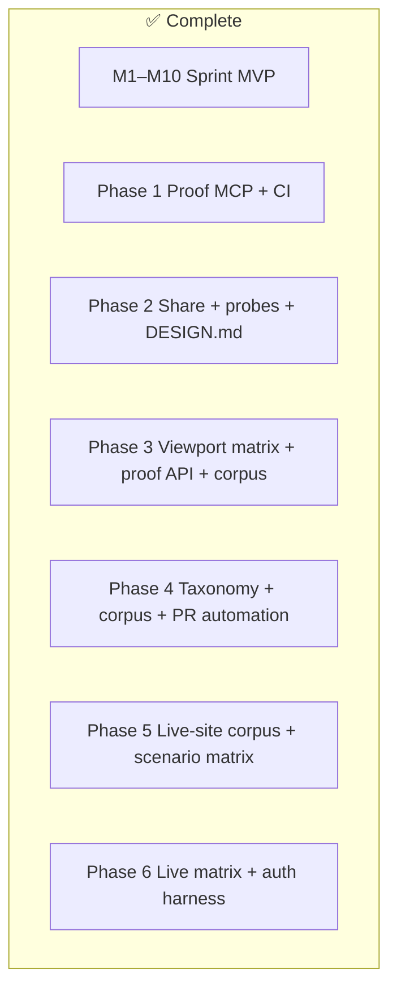

# Tell — Consolidated Plan

> **Single source of truth for remaining work.** All other plan docs either duplicate this,
> are historical specs, or are archived under `docs/archive/`.
>
> Engineering contracts: root [`BUILD.md`](./BUILD.md) (milestones M1–M10).  
> Product status snapshot: [`README.md`](./README.md) § Product Status.  
> Agent routing: [`ORCHESTRATION.md`](./ORCHESTRATION.md).

---

## Visual status


```mermaid
flowchart TB
  subgraph done["✅ Complete"]
    M1[M1–M10 Sprint MVP]
    P1[Phase 1 Proof MCP + CI]
    P2[Phase 2 Share + probes + DESIGN.md]
    P3[Phase 3 Viewport matrix + proof API + corpus]
    P4[Phase 4 Taxonomy + corpus + PR automation]
    P5[Phase 5 Live-site corpus + scenario matrix]
    P6[Phase 6 Live matrix + auth harness]
  end
```

| Layer | Status | Authority |
|---|---|---|
| Sprint MVP M1–M10 | ✅ Done | `BUILD.md` §8 |
| Phase 1 (proof MCP, PR diagnose, golden fixture) | ✅ Done | README |
| Phase 2 (share links, state probes, DesignSystemDrift) | ✅ Done | README |
| Phase 3 (viewport matrix, `/api/proof/verify`, corpus manifest) | ✅ Done | PLAN.md |
| Phase 4 (taxonomy, more corpus, PR proof automation) | ✅ Done | PLAN.md |
| Phase 5 (live-site corpus + scenario matrix) | ✅ Done | PLAN.md |
| Phase 6 (live Playwright matrix + auth storageState harness) | ✅ Done | PLAN.md |
| Stretch cut earlier | ✅ Share links + state probes shipped | was `docs/04` §10 |

---

## Plan inventory (what to keep vs archive)

| Doc | Role | Action |
|---|---|---|
| **`PLAN.md` (this file)** | Consolidated remaining-work plan | **Keep — primary** |
| **`BUILD.md`** | Engineering contracts + M1–M10 DoD | **Keep — never archive** |
| **`ORCHESTRATION.md`** | Agent/model routing | **Keep** |
| **`USER_STORY.md`** | Ashish north star / copy | **Keep** |
| **`README.md` Product Status** | Public shipped/next list | Keep in sync with this file |
| `docs/02_CURSOR_BUILD_INSTRUCTIONS.md` | Exact duplicate of `BUILD.md` | **Archived** → stub |
| `docs/04_CLAUDE_PROJECT.md` §12 tracker | Live tracker | Keep in sync |
| `docs/06_REDESIGN_ENGINE_V2.md` | Redesign v2 build spec | **Archived as shipped** → stub |
| `docs/01`, `03`, `05`, `06_TELL_PROOF`, `DEPLOY*` | Living specs / deploy | **Keep** (not plans) |
| **`docs/07_VISUALIZATION_PLAN.md`** | Interactive / illustration-first educational viz plan | **Keep — separate plan** |
| **`docs/08_AI_DESIGN_METHODS.md`** | Methods for designing with AI + how to add styles | **Keep — separate plan** |
| **`docs/09_PREMIUM_DESIGN_SKILLS.md`** | Premium content-custom skill graph + studio | **Keep — separate plan** |
| **`docs/11_AGENT_PLATFORM_INTEGRATION_PLAN.md`** | MCP / one-click install / CLI / skills / multi-agent | **Keep — separate plan** |
| **`docs/12_AUTH_SECURITY_BOUNDARIES_PLAN.md`** | Capture/API/agent trust envelopes (not product login) | **Keep — separate plan** |
| **`docs/13_DESIGN_CAPABILITY_FLOWS_PLAN.md`** | Common + complex design-task flows for Ashish loop | **Keep — separate plan** |
| `DESIGN.md`, `PITCH.md` | Dogfood contract / pitch | **Keep** |

---

## Phase 6 checklist (DoD) — closed

- [x] Auth harness: Playwright `storageState` via `CaptureUrlOptions` / `TELL_AUTH_STORAGE_STATE`
- [x] Fixture `/account` gate (`tell_session=authenticated`) + `pnpm auth:fixture`
- [x] Fixture `/pricing` route for multi-page demo drift
- [x] `captureScenarioMatrix` passes `authRole` through to `captureUrl`
- [x] Live capture CLI: `pnpm capture:matrix` (+ compact `liveScenarioPlan`)
- [x] CI: boot fixture, mint auth, live matrix capture + self-compare
- [x] MCP `tell_capture_matrix` + web `POST /api/proof/matrix` + Tell Report matrix panel
- [x] Web `/api/diagnose` uses `classifyWithTaste` when `GEMINI_API_KEY` is set (parity with MCP)
- [x] Tracker + README Product Status updated

---

## Phase 5 checklist (DoD) — closed

- [x] Schema: `CaptureScenario`, `ScenarioMatrix`, `ProofCellResult`, `ProofMatrixResult` in `@tell/schema`
- [x] Core: `captureScenarioMatrix` + `compareProofMatrices` (deterministic; zero LLM)
- [x] Detector: `ResponsiveViewportDrift` when mobile/tablet structure collapses vs desktop
- [x] Live-site-style corpus captures: `marketplace-clutter`, `docs-site-calm` (+ generator)
- [x] Committed scenario matrix fixture (`fixtures/corpus/scenario-matrix.json`) covering route × viewport × theme × interaction
- [x] Manifest + taxonomy + golden tests cover new captures, matrix cells, and D8 detector
- [x] `pnpm proof:matrix` smoke + CI step on UI/engine PRs
- [x] Docs: `PLAN.md` closed, README Product Status, `docs/06_TELL_PROOF.md`, tracker §12

---

## Phase 4 checklist (DoD) — closed

- [x] Machine-readable open taxonomy at `fixtures/corpus/taxonomy.json` (+ README)
- [x] Additional corpus captures: `editorial-calm` (0 tells), `fintech-dense` (dense drift profile)
- [x] Manifest + golden tests cover new categories
- [x] GitHub workflow / script for proof-compare on UI PRs
- [x] Cursor after-edit hook reminds agents to run proof-verify on UI changes
- [x] Tracker + README Product Status updated; redundant plans archived

---

## Phase 7 — Premium design craft (active)

Ship stunning, feature-true sites from the skill graph — create from scratch and redesign —
with lean-distinct layouts, restrained motion, and Studio craft tools.

### Checklist (DoD)

- [x] Hero is brand-first (product name hero-level) + one headline + one support + CTA; atmosphere beyond flat paper
- [x] Lean layouts diverge in HTML (`minimal-clean` lists, `conversion-sharp` CTA rhythm, `refined-story` chapters, `system-crafted` token cohesion)
- [x] Dashboard is one shell (aside + main), not two broken grids
- [x] No invented pricing tiers / proof filler — derive from declared features or omit
- [x] Educational surfaces include a deterministic figure (caption + simple instrument) when features teach a mechanism
- [x] Focus-visible, mobile stack, real reduced-motion handling in preview HTML
- [x] Studio: viewport preview widths, copy HTML, businessGoal control; e2e covers craft assertions
- [x] `pnpm test` + `pnpm e2e:studio` + web typecheck green

### Goal prompt (Phase 7 — paste into Composer / Cloud Agent)

```
@PLAN.md @docs/09_PREMIUM_DESIGN_SKILLS.md @docs/07_VISUALIZATION_PLAN.md @docs/08_AI_DESIGN_METHODS.md
@packages/design-skills @apps/web/src/app/studio @agent-skills/web-design/premium-content-custom-web
@USER_STORY.md @docs/01_DESIGN_SYSTEM.md

GOAL: Phase 7 — Make @tell/design-skills + /studio produce stunning, feature-customized
websites from scratch and on redesign. Every aesthetic lean must look distinct. Educational
paths get a figure. Dashboard is one coherent shell. No template filler (fake Starter/Growth
tiers). Studio feels like a craft tool. Playwright proves the loop like a real user.

Non-negotiables:
- Deterministic engine (packages/design-skills) — zero LLM
- Never auto-apply; previews/patches only
- Aesthetic lean codes only (no third-party person/brand names in runtime)
- Content/features drive layout; Taste Controls remain adjustable
- pnpm test + pnpm e2e:studio + pnpm -F @tell/web typecheck must stay green

Done when PLAN.md Phase 7 checklist is all checked.
```

### Loop prompt (Phase 7 — iterate until green)

```
@PLAN.md @docs/09_PREMIUM_DESIGN_SKILLS.md

LOOP:
1. Read PLAN.md Phase 7 checklist — pick the first unchecked item.
2. Implement the smallest craft change in packages/design-skills and/or /studio that satisfies it.
3. Add/adjust unit assertions for HTML structure (lean divergence, dash shell, no filler, figure).
4. Run: pnpm -F @tell/design-skills build && pnpm test && pnpm -F @tell/web typecheck
5. With web on :3000, run: pnpm e2e:studio — fix failures before continuing.
6. Check off the item in PLAN.md; update docs/09 if the quality bar changed.
7. Commit; push cursor/premium-design-skills-8c9e.
8. If any Phase 7 item remains, go to step 1.
9. Stop only when all Phase 7 items are checked and e2e is green.

Stretch (allowed): viewport toggle, copy HTML, section-scoped regenerate, stronger viz instrument.
If blocked: note in Status log and continue with the next unchecked item.
```

---

## Agency-quality site pipeline (Cursor — phased Goal/Loop + autonomous run)

**Authority:** `.cursor/skills/agency-quality-site` · `agent-skills/web-design/premium-content-custom-web/agency-quality-site/`  
**Why separate:** One full-pipeline pass does not compound quality. Each phase must Goal → run → eye → Loop ≤3 → `--mark-pass` before the next phase starts from `current.html`.  
**Autonomous:** `pnpm agency:run -- --query "…"` packages niche → refs → plan → execute → verify → advance.

### Checklist

- [x] Skill + PROMPTS.md with Goal/Loop per phase
- [x] Runner is phase-gated (`--phase`, `--reshoot`, `--mark-pass`, `--status`); craft `--all` refused
- [x] `assertAgencyDelivery` + axis polish helpers in `@tell/design-skills`
- [x] `DESIGN_RIGOR.md` — compositional lanes + honesty bar (principle-only)
- [x] Agent executes Lensroom brief **one phase at a time** through `4-ship` (STATE + PHASE_LEDGER)
- [x] Repeatable misses encoded back into gates / LEARNINGS
- [x] `agency:run` orchestrator — query → niche/brief/DIRECTION → local seeds/corridor → phase loop + auto mark-pass
- [x] `agency-run-learn` — **developer-only** automatic learn + design-data corpus (gated; not Vercel users)
- [x] `tell-user-session-learn` — **end-user** browser profile (directions, priorities, tool prefs)

### Goal prompt (autonomous)

```
@PLAN.md @.cursor/skills/agency-quality-site/SKILL.md

GOAL: Run the autonomous agency pipeline for the named requirement.

pnpm agency:run -- --query "<requirement>" --fresh
# Learn is automatic (agency-run-learn). Optional: TELL_DESIGN_DATA=/path/to/tell-design-data
# Dry smoke only: AGENCY_SKIP_LEARN=1 …

Done when research/boards/<run-id>/STATE.json passed[] includes 4-ship, SHIP.html exists,
and LEARN.md was written by the automatic learn pass.
```

### Goal prompt (manual orchestrator — paste once, still one phase per cycle)

```
@PLAN.md @.cursor/skills/agency-quality-site/SKILL.md
@agent-skills/web-design/premium-content-custom-web/agency-quality-site/PROMPTS.md
@docs/08_AI_DESIGN_METHODS.md @USER_STORY.md

GOAL: Agency-quality site pipeline — execute ONLY the current phase for brief
scripts/agency-pipeline/briefs/lensroom.json (or the brief named in the task).

Rules:
1. pnpm agency:pipeline -- --brief <brief> --status
2. Paste that phase's Goal prompt; run --phase <current>
3. READ screenshots; paste Loop prompt; improve ONLY that axis; --reshoot; ≤3 attempts
4. --mark-pass <current> only when eye + gates pass
5. Repeat until 4-ship is passed
6. Never --all. Never combine typography + spacing + motion in one edit.

Done when STATE.json shows all phases in passed[] through 4-ship and craft shots are posted.
```

### Loop prompt (between phases)

```
@agent-skills/web-design/premium-content-custom-web/agency-quality-site/PROMPTS.md

LOOP:
1. --status — note current phase and attempts
2. If current phase not yet run this cycle: run its Goal prompt
3. Else: run its Loop prompt against the latest PNGs
4. Stop the whole session only when 4-ship is marked pass OR a named blocker after 3 attempts
```

---

## Phase 8 — Agent platform distribution (planned)

Make Tell reachable from coding agents without monorepo archaeology — install-info,
one-command / deeplink MCP install, unified CLI — without weakening deterministic core
or never-auto-apply. Full checklists: `docs/11`, `docs/12`, `docs/13`.

### Checklist (DoD) — open

- [x] Wave 0: MCP tool docs ≡ code (10 tools) + schema enum + CI drift guard
- [x] Wave 1: `GET /api/install-info` + `InstallInfo` zod + print-config
- [x] Wave 2: `tell mcp install` for Cursor (project json + deeplink); other agents print-config
- [x] Wave A0: `TELL_CAPTURE_API_TOKEN` when capture host requires auth
- [x] Wave C0: `tell_voice` MCP + report `id` persistence for redesign chain
- [x] Stretch: intent resolver MCP tool + Settings Connect Agent UI panel

### Goal prompt (Phase 8)

```
@PLAN.md @docs/11_AGENT_PLATFORM_INTEGRATION_PLAN.md @docs/12_AUTH_SECURITY_BOUNDARIES_PLAN.md
@docs/13_DESIGN_CAPABILITY_FLOWS_PLAN.md @packages/mcp @USER_STORY.md

GOAL: Phase 8 — execute next unchecked DoD item above (start Wave 0).
Adapt peer patterns only; never name the peer; never auto-apply; zod everywhere.
pnpm test + schema build + web typecheck stay green.
```

---

## Goal prompt — Phase 6 keep-green (archive)

```
@PLAN.md @BUILD.md @USER_STORY.md @ORCHESTRATION.md @README.md @docs/06_TELL_PROOF.md

GOAL: Keep Phase 6 green — live Playwright scenario matrix + auth storageState harness
remain end-to-end usable (CLI, CI, MCP, web panel) with zero open PLAN checklist items.

Non-negotiables:
- Deterministic core (packages/core) has zero LLM calls
- Never auto-apply patches; proof verify may apply only in disposable checkout
- Schemas via @tell/schema at every boundary
- pnpm test + schema build + web typecheck must stay green
- Preserve offline fixture fallback (fixtures/reports/tell-report.json)
- Auth uses disposable Playwright storageState — do not build product login/OAuth

Done when PLAN.md Phase 6 checklist is all checked and README Product Status lists
no "Next" blockers for matrix/auth.
```

---

## Status log

```
[2026-08-07] Phase 8 stretch shipped — `resolveIntent` + `tell_resolve_intent` MCP + `tell resolve` CLI + Connect Agent UI (11 tools).
[2026-08-07] Phase 8 Waves 0–2/A0/C0 implemented — install-info, Cursor mcp install, tell CLI, tell_voice, capture token, MCP drift guard (10 tools).
[2026-08-07] Opened Phase 8 — agent platform distribution plans (docs/11–13) + plumbing reference memory (gitignored local pointer).
[2026-08-03] Phase 7 closed — craft floor in render/sections, Studio viewport+copy HTML, educational scrub figure, e2e craft assertions green.
[2026-08-03] Opened Phase 7 — premium design craft (hero/atmosphere, lean layouts, dash shell, no filler, edu figure, Studio craft, e2e).
[2026-08-03] Shipped packages/design-skills + /studio + showcases + MCP tell_design_from_features (premium content-custom skill graph).
[2026-07-23] Expanded docs/07_VISUALIZATION_PLAN.md — reusable instruments (median-cut color-space, orthographic wireframes, palette grids, voxel/convolution), vector pipeline, tool-aside narrative; principle-only.
[2026-07-23] Added docs/08_AI_DESIGN_METHODS.md — three design methods (packaged judgment / build by piece / reference board) and mandatory playbook for adding styles; principle-only, no third-party names.
[2026-07-23] Added docs/07_VISUALIZATION_PLAN.md — illustration-first educational viz plan (separate from Phase checklists); scrubbed third-party style-name keywords from explainer parsing.
[2026-07-23] Phase 6 closed — live capture:matrix, auth storageState harness, /pricing+/account fixture, MCP/API/UI matrix, web taste parity.
[2026-07-19] Phase 5 closed — scenario matrix, marketplace/docs corpus, ResponsiveViewportDrift, proof:matrix CI.
[2026-07-19] Phase 5 opened — live-site corpus + scenario matrix (route × viewport × theme × interaction).
[2026-07-17] Phase 4 closed — taxonomy, corpus captures, proof:compare workflow, plan consolidation.
[2026-07-17] Consolidated PLAN.md created; docs/02 + redesign-v2 archived; Phase 3 cherry-picked onto branch.
```
