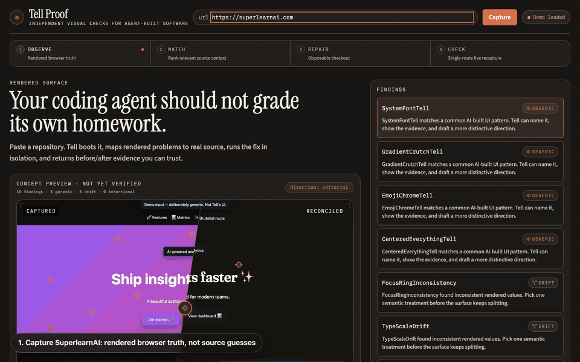

<div align="center">

# Tell Proof

### Independent visual proof for AI-built interfaces.

**Tell Proof captures the UI that users actually see, names the visual tells that make it feel generic or inconsistent, drafts a source-grounded repair, and verifies the result in a disposable checkout before anything touches your app.**

[Demo](#demo) · [Why Tell](#why-tell) · [Features](#features) · [Quick Start](#quick-start) · [Cursor MCP](#cursor-mcp) · [Architecture](#architecture) · [Deploy](#deploy)

[](./LICENSE)
[](https://cursor.com)
[](https://www.typescriptlang.org/)
[](https://nextjs.org/)
[](https://modelcontextprotocol.io/)

<br/>



</div>

---

## Demo

- **Live app:** [tell-five.vercel.app](https://tell-five.vercel.app)
- **Default scan target:** [superlearnai.com](https://superlearnai.com)
- **Offline fallback:** `fixtures/reports/tell-report.json`, so the product still opens with a complete report when live capture is unavailable.
- **Showcase GIF:** `docs/media/tell-superlearnai-demo.gif`, generated from the current UI flow.

Tell can scan a public URL directly, or locally clone a GitHub repository, install dependencies, boot the app on a free port, and capture localhost automatically.

---

## Why Tell

AI agents can generate working interfaces quickly. The harder question is whether the result has taste: a distinctive hierarchy, consistent tokens, reachable states, readable contrast, and a visual language that does not collapse into the same gradient-card-template everyone else ships.

Tell Proof is the independent reviewer for that moment. It does not ask the authoring agent to grade its own output. It opens the page in a real browser, measures the rendered surface, identifies specific genericness and drift patterns, and turns the critique into a reviewable direction.

The authoring agent proposes. Tell measures, critiques, repairs, and verifies.

---

## Features

| Capability | What ships today |
|---|---|
| **Rendered capture** | Playwright opens the route and records screenshot evidence, DOM summary, computed styles, CSS variables, contrast samples, and interactive-state probes. |
| **14 deterministic detectors** | 8 genericness tells and 6 consistency-drift detectors catch system fonts, gradient crutches, shadow overuse, radius monotony, gray mush, token bypasses, spacing chaos, state gaps, focus inconsistency, and more. |
| **Taste engine** | Findings become plain-English verdicts: `generic`, `drift`, `intentional`, or `uncertain`, with confidence and rationale. Gemini can enrich judgment; deterministic fallback keeps the flow usable without keys. |
| **Voice and text art-direction** | Say or type directions like "warmer, more editorial, less shadow". Tell maps intent to a preset and concrete action items before model refinement. |
| **Before/after reveal** | The captured page is compared against a deterministic reconciliation that preserves content while improving hierarchy, contrast, depth, radius, and focus treatment. |
| **Source-grounded redesign diffs** | When a repo is available, Tell ranks real TSX/JSX/CSS files by rendered evidence and drafts a unified diff instead of guessing from a screenshot. |
| **Visual worktree proof** | Candidate patches run inside a disposable checkout. Tell applies, waits for HMR, recaptures, compares score/focus/structure, and auto-reverts failed attempts. |
| **GitHub setup runner** | Paste `github.com/owner/repo`; local Tell clones it, reads `README` and `package.json`, installs dependencies, starts the dev server, and captures the reachable URL. |
| **Multi-page scanning** | Routes discovered from the snapshot can be scanned individually, exposing drift that only appears on pricing, docs, onboarding, or secondary pages. |
| **Cursor MCP** | `tell_capture`, `tell_diagnose`, `tell_redesign`, and `tell_apply` expose the same engine inside Cursor Agent chat. |

Tell is not a replacement for functional, responsive, accessibility, or security testing. It is a focused visual evidence layer for one rendered route at a time.

---

## How It Works

```mermaid
flowchart LR
    url["Public URL or local app"] --> capture["Browser capture"]
    capture --> fingerprint["Design fingerprint"]
    fingerprint --> detectors["Genericness + drift detectors"]
    detectors --> taste["Taste verdicts"]
    taste --> report["Tell Report"]
    report --> direction["Voice/text art-direction"]
    direction --> diff["Source-grounded diff"]
    diff --> proof["Disposable proof checkout"]
    proof --> recapture["Recapture + measured comparison"]
    recapture --> cursor["Review and apply in Cursor"]
```



**Deterministic-first:** capture, fingerprinting, detector output, baseline reconciliation, and score comparison do not depend on a model. Models are only used where judgment or drafting benefits from language.

**Human-reviewed by design:** Tell can prepare a patch and prove it in isolation, but the final change still lands through the developer's normal review workflow.

---

## Quick Start

You need **Node 20+** and **pnpm 9+**.

```bash
git clone <your-repo-url> tell
cd tell
pnpm install
pnpm dev
```

Open [http://localhost:3000](http://localhost:3000). The app starts with SuperlearnAI as the capture target and falls back to the committed report if live capture cannot run.

To use the seeded sample app in a second terminal:

```bash
pnpm dev:fixture   # http://localhost:3001
```

Useful checks:

```bash
pnpm test
pnpm typecheck
pnpm capture:fixture
pnpm diagnose:fixture
pnpm verify:directions   # screenshot all 6 reconcile directions (requires Playwright)
```

Optional environment variables live in `.env.example`:

```bash
GEMINI_API_KEY=            # richer taste and voice parsing
CURSOR_API_KEY=            # Cursor-SDK-backed redesign drafts
CURSOR_MODEL=composer-2.5
CURSOR_AGENT_TIMEOUT_MS=75000
TELL_CAPTURE_API_URL=      # remote Playwright backend for hosted UI
```

---

## Cursor MCP

Tell registers as a local MCP server via `.cursor/mcp.json`. Open this repo in Cursor and ask Agent chat to run the tools directly.

```text
Run tell_diagnose on http://localhost:3001 and draft an editorial redesign.
```

| Tool | Purpose |
|---|---|
| `tell_capture` | Capture screenshot and computed-style evidence for a URL. |
| `tell_diagnose` | Return the full Tell report, findings, verdicts, and score. |
| `tell_redesign` | Draft a redesign proposal for a finding or whole report. |
| `tell_apply` | Return patch text and instructions; it never writes files for you. |
| `tell_proof_verify` | Apply a patch, recapture the URL, and return pass/review/fail with measured deltas. |
| `tell_proof_revert` | Revert the last proof patch in the workspace. |

---

## Architecture

Tell is a pnpm monorepo with one shared engine behind both the web app and MCP server.

```text
tell/
├── apps/web/           # Next.js product UI and API routes
├── packages/schema/    # Zod contracts shared across every boundary
├── packages/core/      # Capture, fingerprint, detectors, diagnosis
├── packages/taste/     # Verdicts, direction presets, voice/text parsing
├── packages/redesign/  # Reconciliation, source patches, proof measures
├── packages/mcp/       # Cursor MCP stdio server
├── fixtures/           # Generic input app and committed report artifacts
└── docs/               # Product, deployment, and design notes
```

Key API routes:

| Route | Responsibility |
|---|---|
| `POST /api/diagnose` | Capture and diagnose a URL, using a remote capture backend when configured. |
| `POST /api/redesign` | Produce a source-aware redesign proposal with deterministic fallback. |
| `POST /api/voice` | Convert transcript/text into direction presets and action items. |
| `POST /api/setup/start` | Local-only GitHub clone/install/run/capture workflow. |
| `POST /api/proof/apply` | Apply a candidate patch in the disposable checkout and verify it. |
| `POST /api/proof/revert` | Revert the proof checkout. |
| `POST /api/reports/share` | Persist a Tell report and return a shareable `/report/[id]` link. |
| `GET /api/reports/[id]` | Load a previously shared report JSON. |
| `GET /api/health/capture` | Check Playwright capture readiness. |

---

## Deploy

The most reliable production shape is a hosted UI plus a separate Playwright capture backend.

| Layer | Platform | Role |
|---|---|---|
| UI | Vercel | Fast Next.js app, report, reveal, voice direction, redesign draft |
| Capture | Vultr, Render, or Docker host | Playwright + Chromium for live URL diagnosis |
| MCP | Local Cursor | Stdio tools for editor-native diagnosis and patch handoff |

Set `TELL_CAPTURE_API_URL` on the Vercel app to point at the capture backend. GitHub clone-and-run is local-only and should stay disabled on public hosts with `TELL_DISABLE_REPO_SETUP=1`.

Deployment guides:

- [Hybrid and single-platform deploy](./docs/DEPLOY.md)
- [Vultr capture backend](./docs/DEPLOY-VULTR.md)

---

## Product Status

Shipped:

- Deterministic capture, fingerprinting, and 14 detectors
- Taste verdicts with safe fallback
- Tell Report with before/after reveal
- Voice/text art-direction
- Cursor MCP tools
- Public URL capture with offline report fallback
- Local GitHub repo setup runner
- Source-grounded redesign proposals
- Contrast-grounded reconciliation
- Multi-page route discovery and per-page scans
- Disposable visual proof loop for candidate patches

Next:

- Broader detector golden corpus across more product categories
- Multi-viewport capture matrix (tablet + mobile)
- Hosted proof sandboxes for Vercel deployments

Shipped in Phase 2:

- Shareable report links (`/api/reports/share`, `/report/[id]`)
- State probe thumbnails on capture (default / hover / focus clips)
- DESIGN.md drift detector (`DesignSystemDrift`) with automatic load in diagnose pipeline
- Tell Proof verify Cursor skill (`.cursor/skills/tell-proof-verify`)
- Dogfood typography consolidation on Tell web UI

Shipped in Phase 1:

- Full 14-detector golden fixture corpus
- `tell_proof_verify` and `tell_proof_revert` MCP tools
- PR preview diagnosis workflow (`.github/workflows/pr-diagnose.yml`)
- Dogfood script (`pnpm dogfood:web`) — Tell UI reports zero generic tells

---

## Contributing

Contributions are welcome. The highest-leverage additions are new detectors, better evidence views, and stronger source mapping.

```bash
pnpm typecheck && pnpm test
```

The sample app under `fixtures/generic-app/` is intentionally bland input data, not the product itself. See [CONTRIBUTIONS.md](./CONTRIBUTIONS.md) for the attribution breakdown.

---

## License

Released under the [MIT License](./LICENSE).
