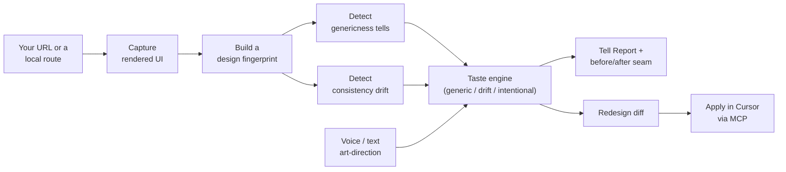

<div align="center">

# Tell

### Every AI-built UI has a tell.

**Tell is an open-source design critic that reads the *rendered* UI of your product, names exactly what makes it look AI-generated, and helps you art-direct a distinctive redesign — without leaving Cursor.**

[Quick start](#quick-start) · [Features](#features) · [How it works](#how-it-works) · [Use it in Cursor](#use-it-in-cursor) · [Project structure](#project-structure)

[](./LICENSE)
[](https://cursor.com)
[](https://www.typescriptlang.org/)
[](https://nextjs.org/)
[](https://modelcontextprotocol.io/)

<br/>


The shipped README demo asset lives in `docs/media/tell-demo.gif`. Raw Playwright recordings can be regenerated under `output/playwright/`, which stays ignored as local build output.

</div>

---

## The problem

You can ship a whole product in a weekend now. That's the good news.

The bad news is that most of what gets shipped looks *identical*. Inter everywhere. One purple gradient in the hero. A soft shadow on every card. Rounded corners at exactly 8 pixels. It isn't ugly — it's **forgettable**. And as you and your AI agent keep iterating, the surface quietly drifts: six almost-identical grays, focus rings that only half the app bothers with, an empty state nobody designed.

You can *feel* that something is off, but you can't name it. "Add more whitespace" isn't a direction. Hiring a designer for a day is $800 and a two-week wait. Your demo is tomorrow.

**Tell fixes the part that's actually hard: knowing what's wrong, and showing you a better direction you can ship yourself.**

---

## What Tell does

Tell looks at your product the way a person does — it opens the page in a real browser and reads what actually renders, not your source code. Then it does four things:

1. **Names the tells.** It points at the specific patterns that read as generic, with evidence you can see on the screenshot.
2. **Catches the drift.** It flags where your design has quietly become inconsistent across the surface.
3. **Uses taste, not lint rules.** It tells the difference between a lazy default and a deliberate choice, and explains why.
4. **Closes the loop in Cursor.** You describe a direction in plain English (or with your voice), and Tell drafts the redesign as a diff you apply right inside your editor.

No new dashboard to babysit. No design handoff. No leaving your workflow.

---

## Features

| | Feature | What it does |
|---|---|---|
| 🔍 | **Rendered capture** | Opens your URL in a headless browser and records a full screenshot plus a computed-style fingerprint — fonts, colors, shadows, radii, spacing, contrast, and interactive states. |
| 🎯 | **8 genericness detectors** | Deterministic checks for the classic AI tells: `SystemFontTell`, `GradientCrutchTell`, `ShadowEverywhereTell`, `RadiusMonotoneTell`, `AcidAccentTell`, `EmojiChromeTell`, `CenteredEverythingTell`, `GrayMushTell`. |
| 📉 | **6 consistency-drift detectors** | Catches the slow decay: `TokenBypass`, `NearDuplicateValues`, `FocusRingInconsistency`, `TypeScaleDrift`, `SpacingChaos`, `StateGap`. |
| 🧠 | **Taste engine** | Classifies every finding as *generic*, *drift*, or *intentional* with a plain-English rationale and a confidence score. A reflection pass rejects any reasoning that contradicts the measured facts. |
| 🎙️ | **Voice art-direction** | Say "warmer, more editorial, less shadow" and Tell re-proposes a direction. Falls back to text presets so a demo never dies on a bad mic. |
| 🪄 | **Redesign as a diff** | Turns a chosen direction into a unified diff. It **never** auto-applies — you stay in control. |
| ↔️ | **Before/after seam** | A draggable diagonal reveal between your captured page and a live reconciliation — same content, restyled from detected tokens. |
| 🐙 | **GitHub repo setup** | Paste `github.com/owner/repo` and Tell clones it, reads the README, installs deps, boots the dev server, and captures localhost automatically. |
| 📄 | **Multi-page scanning** | Discovers routes from the captured snapshot; scan each page to catch drift that only shows on some routes. |
| 🔌 | **Cursor MCP server** | Run the whole pipeline from Cursor chat with `tell_capture`, `tell_diagnose`, `tell_redesign`, and `tell_apply`. |

---

## How it works

Tell is one pipeline, shared by both the web app and the Cursor MCP server. Everything up to the taste step is **deterministic** — no model, no network — so results are reproducible run to run. The model is only used for judgment and for drafting diffs.



**Why deterministic-first matters:** the parts that must be trustworthy — reading the page and measuring it — never hallucinate. The model only weighs in where judgment is genuinely needed, and even then its rationale is checked against the hard facts before you see it.

---

## Quick start

You'll need **Node 20+** and **pnpm 9+**.

```bash
git clone <your-repo-url> tell
cd tell
pnpm install
```

Then start the Tell app:

```bash
pnpm dev           # the Tell app → http://localhost:3000
```

**The one-click way — point Tell at a GitHub repo.** Paste a repo URL (e.g. `github.com/owner/app`) into the bar and hit **Set up &amp; run**. Tell clones it, reads the README + `package.json` to figure out how to start it, installs, boots the dev server on a free port, and captures the localhost URL automatically. If the run steps aren't clear, Tell shows what it found from the README and asks you to start it and paste the URL — no guessing.

**The direct way — capture any URL.** Paste a live URL (your deployed app, or a local `http://localhost:3000`) and hit **Capture**.

Either way: read the report, walk every page from the **Pages** strip, drag the before/after seam, art-direct a new direction, draft the diff, and copy it back into Cursor.

<details>
<summary><strong>Prefer the seeded sample app?</strong></summary>

Run the deliberately bland fixture in a second terminal and capture it:

```bash
pnpm dev:fixture   # a deliberately bland sample app → http://localhost:3001
```

</details>

> **No time to wait on live capture?** Tell ships with a committed report at `fixtures/reports/tell-report.json` and loads it automatically as an offline fallback, so the demo always works.

<details>
<summary><strong>Environment variables (optional)</strong></summary>

Copy `.env.example` to `.env` and fill in what you have. Tell runs fully without keys — the taste and redesign steps simply fall back to their deterministic behavior.

```bash
GEMINI_API_KEY=      # powers the taste engine's richer rationales
ANTHROPIC_API_KEY=   # powers full redesign diffs (optional)
```

</details>

<details>
<summary><strong>Handy scripts</strong></summary>

```bash
pnpm test              # run the golden detector tests
pnpm typecheck         # strict type-check across every package
pnpm capture:fixture   # capture the sample app to a fresh report
pnpm diagnose:fixture  # diagnose the sample app from a capture
```

</details>

---

## Use it in Cursor

Tell registers itself as an MCP server, so you can drive the whole pipeline from Cursor's Agent chat.

1. Open this repo in Cursor — the `tell` server is already registered in `.cursor/mcp.json`.
2. In Agent chat, ask for a diagnosis in plain English:

   > "Run `tell_diagnose` on `http://localhost:3001` and draft an editorial redesign."

3. Review the findings and the proposed diff, then apply it — Tell hands you the patch, but you decide what lands.

**Available tools**

| Tool | What it returns |
|---|---|
| `tell_capture` | The rendered screenshot + computed-style evidence for a URL. |
| `tell_diagnose` | The full report: findings, taste verdicts, and the Tell score. |
| `tell_redesign` | A redesign proposal (patch text) for one finding or the whole report. |
| `tell_apply` | The unified diff plus instructions — it never writes files for you. |

---

## Project structure

Tell is a pnpm monorepo. Each package has one job.

```
tell/
├── packages/
│   ├── schema/      # zod contracts shared by everything
│   ├── core/        # capture + fingerprint + detectors (pure, no model)
│   ├── taste/       # taste engine + voice/text art-direction
│   ├── redesign/    # turns a direction into a diff
│   └── mcp/          # the Cursor-facing MCP server
├── apps/
│   └── web/         # the Tell app: report, before/after seam, voice director
├── fixtures/
│   ├── generic-app/ # a deliberately bland app used as demo input
│   └── reports/     # a committed report artifact for offline demos
└── docs/            # design system and reference notes
```

---

## Tech stack

| Layer | Choice |
|---|---|
| Language | TypeScript (strict) |
| Monorepo | pnpm workspaces |
| Capture | Playwright / Chrome DevTools Protocol |
| Web app | Next.js 14 + Tailwind CSS |
| Taste reasoning | Google Gemini |
| Redesign diffs | Anthropic |
| Editor integration | Model Context Protocol (stdio) |
| Validation | zod |
| Tests | Vitest (golden detector tests) |

---

## Roadmap

- [x] Deterministic capture → fingerprint → 14 detectors
- [x] Taste engine with reflection + safe fallback
- [x] Tell Report with draggable before/after seam
- [x] Voice art-direction with text-preset fallback
- [x] Cursor MCP server (`capture` / `diagnose` / `redesign` / `apply`)
- [x] Live URL capture (any reachable HTTP URL, with offline artifact fallback)
- [x] GitHub repo setup — clone, install, run, and capture localhost
- [x] Token-grounded live reconciliation in the before/after seam
- [x] Multi-page route discovery and per-page scanning
- [ ] Per-state evidence thumbnails (hover, focus, error) in the report
- [ ] A shareable, hosted report link

---

## Contributing

Contributions are welcome. The short version:

1. Fork the repo and create a branch: `git checkout -b feature/your-idea`
2. Make your change and keep it green: `pnpm typecheck && pnpm test`
3. Open a pull request describing the *why*, not just the *what*.

New detectors are the highest-leverage contribution — they live in `packages/core/src/detectors` and each ships with a golden test.

---

## License

Released under the [MIT License](./LICENSE).

The sample app under `fixtures/generic-app/` is a deliberately bland demo target used only as input for Tell — it is not part of the product. See [CONTRIBUTIONS.md](./CONTRIBUTIONS.md) for the full breakdown of what's original work versus demo input.
