<div align="center">

# Tell Proof

### The independent design layer for Cursor and agent harnesses.

**Agents write code. Tell proves the UI — then helps you ship design that looks intentional, not AI-default.**

[Specimens](#specimens--craft-reels-not-theme-packs) · [Why Tell](#why-tell-revolutionizes-design-for-cursor) · [Demo](#demo) · [Features](#features) · [Quick Start](#quick-start) · [Cursor MCP](#cursor-mcp) · [Platform Compatibility](#platform-compatibility) · [Architecture](#architecture) · [Deploy](#deploy)

[](./LICENSE)
[](https://cursor.com)
[](https://www.typescriptlang.org/)
[](https://nextjs.org/)
[](https://modelcontextprotocol.io/)

<br/>

[](./docs/media/tell-proof-demo.mp4)

<p><a href="./docs/media/tell-proof-demo.mp4">Watch the MP4</a> · ~40s · Report loop + Studio create/redesign + showcases</p>

</div>

---

## Specimens — craft reels, not theme packs

Tell ships a fourteen-offering catalog under [`/showcase`](./apps/web/src/app/showcase). The hero stage **slowly tours** the best craft beat from each specimen. Filmstrip cells stay still until **hover** — then that offering’s reel plays. Not a cropped nav strip and not a one-size card grid restyled with new colors.


### First five (marketing kinds — distinct folds)

Plumbing + craft pass: each of the first five owns an unreplicable fold instrument (pipeline board, queue console, diligence posture, mechanism scrub, wire ledger) — not stackfold retunes or figure ORDER swaps.

| SaaS · Northstar | Operator console · Queueboard |
|:---:|:---:|
|  |  |
| 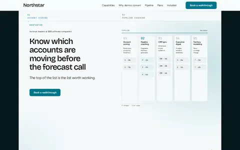 | 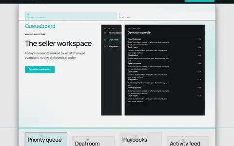 |
| Pipeline stage rail + pipeline board | Priority rail + queue console → app shell |

| Trust narrative · Lattice | Mechanism explainer · Signal Path |
|:---:|:---:|
|  | 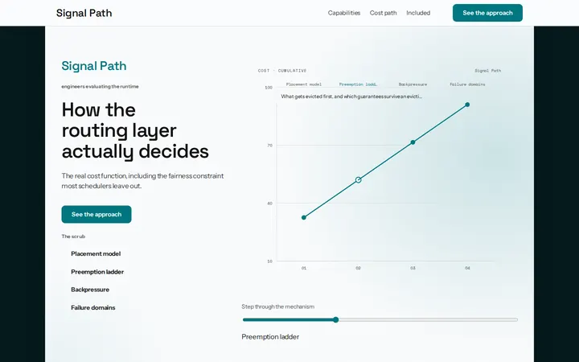 |
| 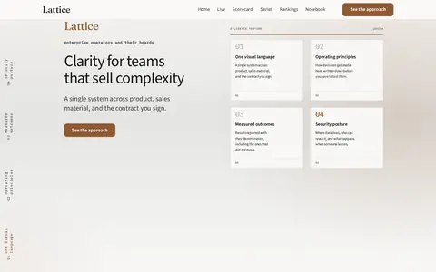 | 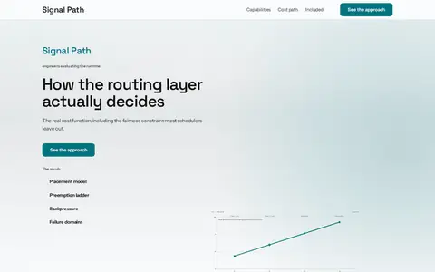 |
| Principle spine + posture grid | Mechanism scrub owns the fold |

| Fintech trust · Clearwire | |
|:---:|:---:|
| 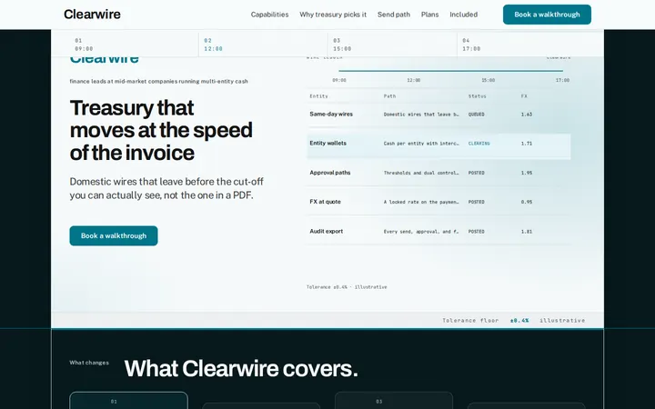 | |
| 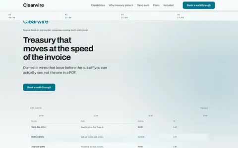 | |
| Cutoff rail + wire ledger + tolerance strip | |

### Signature craft offerings

These are not “SaaS with a different accent.” Each `siteKind` owns unreplicable structure — measured against research corridors, dogfooded until critique holds.

| Archive index · Stamp Roll | Signal observatory · Nightglass |
|:---:|:---:|
| 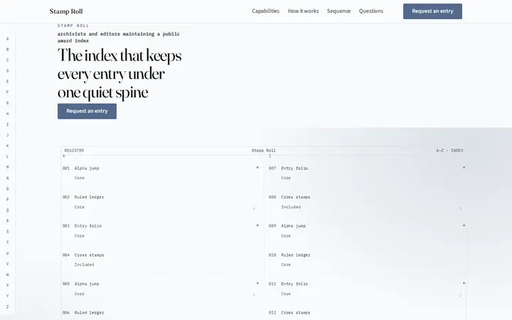 | 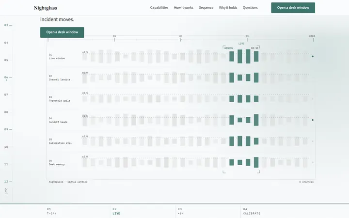 |
| Quiet register, sticky alpha rail, multi-column ledger | Chronometer fold, scrub rail, channel lattice |

| Research dossier · Meridian Atlas | Editorial foundry · Glyph Press |
|:---:|:---:|
| 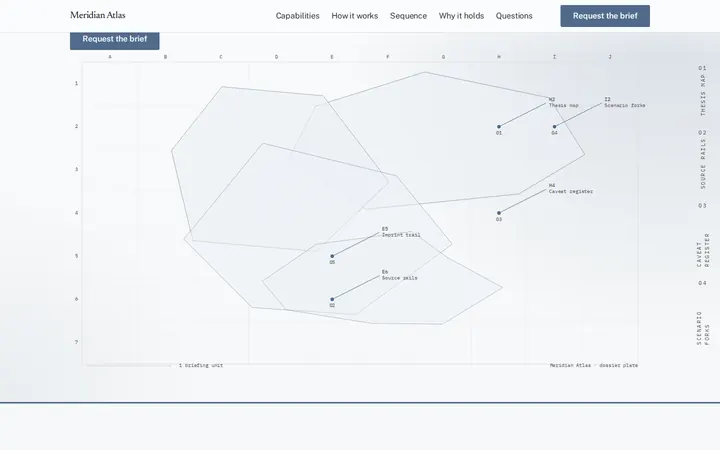 | 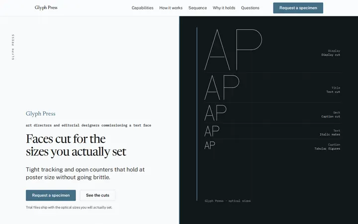 |
| Folio masthead, chapter rail, dossier plate, imprint | Hard-seam fold, type ladder, marginalia, colophon |

Regenerate README frames + first-five reels (web on `:3000`), then optimize to WebP:

```bash
pnpm capture:readme-showcase
pnpm -F @tell/core exec tsx ../../scripts/capture-first5-reels.ts
pnpm media:webp
```

---

## Why Tell revolutionizes design for Cursor

Coding agents inside Cursor (and other harnesses) are extraordinary at shipping working software. They are much weaker at **visual authorship**. Ask an agent to “make it prettier” and you usually get the same defaults again: system fonts, violet accents, shadow-on-every-card, emoji chrome, monotone radius, mushy gray hierarchy.

That is not a failure of effort. It is a structural gap:

| What the harness optimizes | What production UI actually needs |
|---|---|
| Compiling code that runs | A composition users trust in the first viewport |
| Local file edits that “look better” | Measured contrast, token rhythm, and state coverage |
| The same model judging its own output | An independent visual proof loop |
| Prompt-only taste / one universal layout kit | Kind-specific craft + detectors that cannot be waved away |

**Tell is the missing design runtime for agent-built software.** It sits beside Cursor as an independent critic and craft engine:

1. **Observe** — Playwright captures the rendered page users actually see.
2. **Name** — Fourteen deterministic detectors call out genericness and drift with evidence.
3. **Direct** — Voice/text art-direction becomes concrete action items and a reconciled after-state.
4. **Repair** — Source-ranked diffs land as reviewable patches — never silent auto-apply.
5. **Prove** — Disposable checkouts recapture before/after so the harness can trust the fix.
6. **Author** — Tell Studio turns product features into premium, lean-distinct layouts via a skill graph — so Cursor is not inventing another generic SaaS template from scratch.

The authoring agent proposes. Tell measures, critiques, redesigns, and verifies. Humans stay in control.

### Why this is a higher bar than “generate a pretty page”

Most agent UI pipelines stop at HTML that compiles and looks fine in a thumbnail. Tell raises the floor in ways a prompt lottery cannot:

| Prompt-only / generic kit | Tell |
|---|---|
| One layout grammar restyled per product | **Twelve site kinds** with distinct fold grammar (press sheet, ledger, lattice, dossier plate, optical seam, …) |
| Taste lives only in the model’s prior | **Deterministic detectors + critique bands** — scores and evidence, not vibes |
| Nav crop as “proof” of craft | **Craft reels** that scroll to plate / spread / imprint beats |
| Filler tiers and lorem sections | **Feature-derived** pricing, proof, and instruments from the brief you typed |
| “Looks better” with no receipt | **Contrast floor, token rhythm, state coverage** reported on the after-state |
| Agent grades its own homework | **Independent capture → diagnose → reconcile → proof** loop beside Cursor |

- **Brand-first composition** — product identity leads the first viewport; the hero is not a dashboard of widgets.
- **Atmosphere over flat canvas** — gradients, paper grain, and depth used with intent — not purple-on-white defaults.
- **Token discipline** — type scale, spacing grid, radius, and depth become one system instead of eleven accidental sizes and fourteen random gaps.
- **Contrast as a hard floor** — reconciliation reports WCAG-minded contrast so “prettier” never means unreadable.
- **State coverage** — empty, loading, error, and focus-visible are first-class, not afterthoughts.
- **Lean-distinct layouts** — SaaS, dashboard, corporate, educational, fintech, studio, consumer, foundry, dossier, observatory, and archive route through different skill paths.
- **Feature-derived content** — pricing, proof, and sections come from the brief you typed — not Starter/Growth filler.

The result is UI that feels **authored for production**, not assembled from the model’s prior.

### How harnesses (especially Cursor) get better

| Harness pain | Tell response |
|---|---|
| Agent grades its own homework | Independent browser capture + scored findings |
| “Make it nice” loops regenerate sameness | Named tells + direction presets with measurable deltas |
| Patches look fine in chat, break in the browser | Disposable proof: apply → HMR → recapture → compare |
| No designer on the team | Studio skill graph + MCP tools inside Agent chat |
| Demo tomorrow, UI still generic | Capture → seam → voice → draft fix → apply in Cursor |

In Cursor Agent chat you can run the same engine through MCP (`tell_diagnose`, `tell_redesign`, `tell_proof_verify`, `tell_design_from_features`, …). The harness keeps writing code; Tell keeps the visual bar honest.

---

## Demo

The GIF above walks the full product loop:

1. **Tell Report** — paste a live URL, capture the fixture app, read named findings on the real surface.
2. **Reconciliation** — before/after reveal with contrast, type scale, spacing, depth, and accent discipline.
3. **Art-direction** — editorial / precision / warm presets map to concrete action items.
4. **Tell Studio** — generate SaaS, dashboard, corporate, and educational surfaces from features.
5. **Magic redesign + viewports** — redesign from a text cue; flip mobile/desktop preview.
6. **Showcases** — premium compositions that prove the craft floor without a prompt lottery. See [Specimens](#specimens--craft-reels-not-theme-packs) for stills of the top templates.

Regenerate media locally (web on `:3000`, fixture on `:3001`):

```bash
pnpm record:readme-demo
pnpm capture:readme-showcase   # /showcase + top template folds for README
```

---

## Features

| Capability | What ships today |
|---|---|
| **Rendered capture** | Playwright opens the route and records screenshot evidence, DOM summary, computed styles, CSS variables, contrast samples, and interactive-state probes. |
| **14 deterministic detectors** | 8 genericness tells and 6 consistency-drift detectors catch system fonts, gradient crutches, shadow overuse, radius monotony, gray mush, token bypasses, spacing chaos, state gaps, focus inconsistency, and more. |
| **Taste engine** | Findings become plain-English verdicts: `generic`, `drift`, `intentional`, or `uncertain`, with confidence and rationale. Gemini can enrich judgment; deterministic fallback keeps the flow usable without keys. |
| **Voice and text art-direction** | Say or type directions like "warmer, more editorial, less shadow". Tell maps intent to a preset and concrete action items before model refinement. |
| **Before/after reveal** | The captured page is compared against a deterministic reconciliation that preserves content while improving hierarchy, contrast, depth, radius, and focus treatment. |
| **Tell Studio + design skills** | Feature brief → site-kind routing → tokens → sections → `previewHtml`. Lean codes (`minimal-clean`, `conversion-sharp`, `system-crafted`, `refined-story`) keep layouts distinctive without designer folklore. |
| **Source-grounded redesign diffs** | When a repo is available, Tell ranks real TSX/JSX/CSS files by rendered evidence and drafts a unified diff instead of guessing from a screenshot. |
| **Visual worktree proof** | Candidate patches run inside a disposable checkout. Tell applies, waits for HMR, recaptures, compares score/focus/structure, and auto-reverts failed attempts. |
| **GitHub setup runner** | Paste `github.com/owner/repo`; local Tell clones it, reads `README` and `package.json`, installs dependencies, starts the dev server, and captures the reachable URL. |
| **Multi-page scanning** | Routes discovered from the snapshot can be scanned individually, exposing drift that only appears on pricing, docs, onboarding, or secondary pages. |
| **Cursor MCP** | `tell_capture`, `tell_diagnose`, `tell_redesign`, `tell_apply`, `tell_proof_verify`, `tell_proof_revert`, `tell_capture_matrix`, and `tell_design_from_features` expose the same engine inside Cursor Agent chat. |
| **Scenario matrix** | Live Playwright capture across route × viewport × theme × interaction × auth (storageState), with CI smoke against the fixture and a Tell Report panel. |

Tell is not a replacement for functional, responsive, accessibility, or security testing. It is a focused visual evidence and craft layer — the piece most agent harnesses still skip.

---

## How It Works

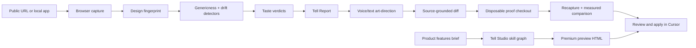
```mermaid
flowchart LR
    url["Public URL or local app"] --> capture["Browser capture"]
    capture --> fingerprint["Design fingerprint"]
    fingerprint --> detectors["Genericness + drift detectors"]
    detectors --> taste["Taste verdicts"]
    taste --> report["Tell Report"]
    report --> direction["Voice/text art-direction"]
    direction --> diff["Source-grounded diff"]
    diff --> proof["Disposable proof checkout"]
    proof --> recapture["Recapture + measured comparison"]
    recapture --> cursor["Review and apply in Cursor"]
    features["Product features brief"] --> studio["Tell Studio skill graph"]
    studio --> preview["Premium preview HTML"]
    preview --> cursor
```

**Deterministic-first:** capture, fingerprinting, detector output, baseline reconciliation, Studio routing/tokens/sections, and score comparison do not depend on a model. Models are only used where judgment or drafting benefits from language.

**Human-reviewed by design:** Tell can prepare a patch and prove it in isolation, but the final change still lands through the developer's normal review workflow.

---

## Quick Start

You need **Node 20+** and **pnpm 9+**.

```bash
git clone <your-repo-url> tell
cd tell
pnpm install
pnpm dev
```

Open [http://localhost:3000](http://localhost:3000) for Tell Report, or [http://localhost:3000/studio](http://localhost:3000/studio) for Tell Studio. The report starts with a demo capture target and falls back to the committed offline report if live capture cannot run.

To use the seeded sample app in a second terminal:

```bash
pnpm dev:fixture   # http://localhost:3001
```

Useful checks:

```bash
pnpm test
pnpm typecheck
pnpm capture:fixture
pnpm diagnose:fixture
pnpm e2e:studio
pnpm auth:fixture        # mint Playwright storageState for /account (fixture must be up)
pnpm capture:matrix      # live scenario matrix (set TELL_MATRIX_URL)
pnpm verify:directions   # screenshot all 6 reconcile directions (requires Playwright)
pnpm record:readme-demo  # regenerate docs/media/tell-proof-demo.{mp4,poster.webp}
pnpm media:webp          # PNG/GIF → display-sized WebP (prunes sources)
```

Optional environment variables live in `.env.example`:

```bash
GEMINI_API_KEY=            # richer taste and voice parsing
CURSOR_API_KEY=            # Cursor-SDK-backed redesign drafts
CURSOR_MODEL=composer-2.5
CURSOR_AGENT_TIMEOUT_MS=75000
TELL_CAPTURE_API_URL=      # remote Playwright backend for hosted UI
```

---

## Cursor MCP

Tell registers as a local MCP server via `.cursor/mcp.json`. Open this repo in Cursor and ask Agent chat to run the tools directly.

```text
Run tell_diagnose on http://localhost:3001 and draft an editorial redesign.
Design a dashboard from these features with tell_design_from_features.
```

| Tool | Purpose |
|---|---|
| `tell_capture` | Capture screenshot and computed-style evidence for a URL. |
| `tell_diagnose` | Return the full Tell report, findings, verdicts, and score. |
| `tell_redesign` | Draft a redesign proposal for a finding or whole report. |
| `tell_apply` | Return patch text and instructions; it never writes files for you. |
| `tell_proof_verify` | Apply a patch, recapture the URL, and return pass/review/fail with measured deltas. |
| `tell_proof_revert` | Revert the last proof patch in the workspace. |
| `tell_capture_matrix` | Live Playwright scenario matrix (route × viewport × theme × interaction × auth). |
| `tell_design_from_features` | Generate a premium layout from a product brief (Studio skill graph). |

---

## Platform Compatibility

Tell ships as **skills, a CLI, and an MCP server** that mainstream coding agents consume natively. Once the monorepo is installed, a single `tell mcp install <platform>` wires the MCP server into that agent’s config — same tools from inside any host.

| Coding agent / platform | Status | One-line MCP install |
|---|:---:|---|
| Cursor | ✅ Supported | `tell mcp install cursor --project` |
| Claude Code | ✅ Supported | `tell mcp install claude` |
| Codex CLI | ✅ Supported | `tell mcp install codex --project` |
| Grok Build | ✅ Supported | `tell mcp install grok --project` |
| OpenCode | ✅ Supported | `tell mcp install opencode --project` |
| VS Code + GitHub Copilot | ✅ Supported | `tell mcp install vscode --project` |
| Windsurf | ✅ Supported | `tell mcp install windsurf --user` |
| Zed | ✅ Supported | `tell mcp install zed --project` |
| Cline (VS Code) | ✅ Supported | `tell mcp install cline --user` |
| Kiro | ✅ Supported | `tell mcp install kiro --project` |
| Kimi Code | ✅ Supported | `tell mcp install kimi --project` |
| Qwen Code | ✅ Supported | `tell mcp install qwen --project` |
| Pi Agent | ✅ Supported | `tell mcp install pi --user` |
| Trae | ✅ Supported | `tell mcp install trae --user` |
| Antigravity | ✅ Supported | `tell mcp install antigravity --user` |
| Hermes Agent | ✅ Supported | `tell mcp install hermes --user` |
| OpenClaw | ✅ Supported | `tell mcp install openclaw --user` |
| Muse Code | 📋 Snippet | `tell mcp install muse --print` |
| Z Code | 📋 Snippet | `tell mcp install zcode --print` |

```bash
tell mcp platforms                          # markdown table
tell mcp install <platform> --print         # dry-run snippet
tell mcp print-config                       # all agent snippets + Cursor deeplink
tell install-info --markdown                # catalog + snippets
```

Tell does **not** spawn third-party coding agents as subprocesses. Compatibility means MCP install into the agent you already use.

---

## Architecture

Tell is a pnpm monorepo with one shared engine behind both the web app and MCP server.

```text
tell/
├── apps/web/              # Next.js product UI and API routes
├── packages/schema/       # Zod contracts shared across every boundary
├── packages/core/         # Capture, fingerprint, detectors, diagnosis
├── packages/taste/        # Verdicts, direction presets, voice/text parsing
├── packages/redesign/     # Reconciliation, source patches, proof measures
├── packages/design-skills/# Feature → route → tokens → sections → preview HTML
├── packages/mcp/          # Cursor MCP stdio server
├── fixtures/              # Generic input app and committed report artifacts
└── docs/                  # Product, deployment, and design notes
```

Key API routes:

| Route | Responsibility |
|---|---|
| `POST /api/diagnose` | Capture and diagnose a URL, using a remote capture backend when configured. |
| `POST /api/redesign` | Produce a source-aware redesign proposal with deterministic fallback. |
| `POST /api/voice` | Convert transcript/text into direction presets and action items. |
| `POST /api/design` | Tell Studio — generate or redesign from a feature brief. |
| `POST /api/setup/start` | Local-only GitHub clone/install/run/capture workflow. |
| `POST /api/proof/apply` | Apply a candidate patch in the disposable checkout and verify it. |
| `POST /api/proof/verify` | Hosted proof sandbox — compare two reports on Vercel, or apply+recapture on the capture backend. |
| `POST /api/proof/matrix` | Live scenario-matrix capture (+ optional self-compare). |
| `POST /api/proof/revert` | Revert the proof checkout. |
| `POST /api/reports/share` | Persist a Tell report (Neon → Blob → disk) and return a shareable `/report/[id]` link. |
| `GET /api/reports/[id]` | Load a previously shared report JSON. |
| `GET /api/health/capture` | Check Playwright capture readiness. |

---

## Deploy

The most reliable production shape is a hosted UI plus a separate Playwright capture backend.

| Layer | Platform | Role |
|---|---|---|
| UI | Vercel | Fast Next.js app, report, reveal, voice direction, Studio, redesign draft |
| Capture | Vultr, Render, or Docker host | Playwright + Chromium for live URL diagnosis |
| MCP | Local Cursor | Stdio tools for editor-native diagnosis and patch handoff |

Set `TELL_CAPTURE_API_URL` on the Vercel app to point at the capture backend. GitHub clone-and-run is local-only and should stay disabled on public hosts with `TELL_DISABLE_REPO_SETUP=1`.

For durable share links on Vercel, set `DATABASE_URL` from a Neon project (preferred) or link a Blob store (see [DEPLOY.md](./docs/DEPLOY.md)). For PR preview diagnosis CI, set the GitHub repo variable `TELL_PREVIEW_URL` to your stable Vercel URL.

Deployment guides:

- [Hybrid and single-platform deploy](./docs/DEPLOY.md)
- [Vultr capture backend](./docs/DEPLOY-VULTR.md)

---

## Product Status

Shipped:

- Deterministic capture, fingerprinting, and 14 detectors
- Taste verdicts with safe fallback
- Tell Report with before/after reveal
- Voice/text art-direction
- Tell Studio + `@tell/design-skills` skill graph (create / redesign / magic edit)
- Showcase surfaces for SaaS, dashboard, corporate, and educational
- Cursor MCP tools including `tell_design_from_features`
- Public URL capture with offline report fallback
- Local GitHub repo setup runner
- Source-grounded redesign proposals
- Contrast-grounded reconciliation
- Multi-page route discovery and per-page scans
- Disposable visual proof loop for candidate patches

Next:

- Optional stretch only — no open PLAN blockers. Hosted public demos still need `TELL_CAPTURE_API_URL` for Playwright-backed matrix/setup.

Shipped in Phase 7:

- Premium design-skills engine and Studio UI
- Feature-derived sections, lean aesthetic codes, craft-floor layouts
- MCP `tell_design_from_features` + `POST /api/design`
- Studio Playwright e2e (`pnpm e2e:studio`)

Shipped in Phase 6:

- Authenticated scenario cells via Playwright `storageState` (`TELL_AUTH_STORAGE_STATE`, `pnpm auth:fixture`)
- Fixture `/account` auth gate + `/pricing` drift route for multi-page demos
- Live matrix capture: `pnpm capture:matrix`, CI against fixture, MCP `tell_capture_matrix`, `POST /api/proof/matrix`, Tell Report panel
- Web diagnose taste parity with MCP when `GEMINI_API_KEY` is set

Shipped in Phase 5:

- Scenario matrix schemas + `captureScenarioMatrix` / `compareProofMatrices`
- `ResponsiveViewportDrift` detector (D8) when secondary viewports lose structure
- Live-site corpus profiles: `marketplace-clutter`, `docs-site-calm`
- Committed `fixtures/corpus/scenario-matrix.json` + `pnpm proof:matrix` CI smoke

Shipped in Phase 4:

- Open taxonomy / benchmark asset (`fixtures/corpus/taxonomy.json` + README)
- Additional corpus captures: `editorial-calm` (0 tells), `fintech-dense` (dense drift)
- PR proof-compare workflow (`.github/workflows/pr-proof-compare.yml`) + `pnpm proof:compare`
- Cursor after-edit hook reminds agents to run proof-verify on UI changes
- Consolidated remaining-work plan: root `PLAN.md` (archived duplicate plans under `docs/archive/`)

Shipped in Phase 3:

- Multi-viewport capture matrix (desktop + tablet + mobile) with viewport strip in the report
- Hosted proof verify API (`POST /api/proof/verify`) — compare mode on Vercel, patch mode on capture backend
- Detector golden corpus manifest (`fixtures/corpus/manifest.json`) with regression test
- Cursor rule for auto proof-verify (`.cursor/rules/tell-proof-verify.mdc`)
- Cursor Cloud environment setup docs in `AGENTS.md`

Shipped in Phase 2:

- Shareable report links (`/api/reports/share`, `/report/[id]`) with Neon Postgres preferred, Blob fallback
- State probe thumbnails on capture (default / hover / focus clips)
- DESIGN.md drift detector (`DesignSystemDrift`) with automatic load in diagnose pipeline
- Tell Proof verify Cursor skill (`.cursor/skills/tell-proof-verify`)
- Dogfood typography consolidation on Tell web UI

Shipped in Phase 1:

- Full 14-detector golden fixture corpus
- `tell_proof_verify` and `tell_proof_revert` MCP tools
- PR preview diagnosis workflow (`.github/workflows/pr-diagnose.yml`)
- Dogfood script (`pnpm dogfood:web`) — Tell UI reports zero generic tells and zero drift

---

## Contributing

Contributions are welcome. The highest-leverage additions are new detectors, stronger Studio skills, better evidence views, and tighter source mapping for harness workflows.

```bash
pnpm typecheck && pnpm test
```

The sample app under `fixtures/generic-app/` is intentionally bland input data, not the product itself. See [CONTRIBUTIONS.md](./CONTRIBUTIONS.md) for the attribution breakdown.

---

## License

Released under the [MIT License](./LICENSE).
