<div align="center">

# Tell Proof

### The independent design layer for Cursor and agent harnesses.

**Agents write code. Tell proves the UI - then helps you ship design that looks intentional, not AI-default.**

[Specimens](#specimens) · [Why Tell](#why-tell) · [Demo](#demo) · [Features](#features) · [Quick Start](#quick-start) · [Cursor MCP](#cursor-mcp) · [Platform Compatibility](#platform-compatibility) · [Architecture](#architecture) · [Deploy](#deploy)

[](./LICENSE)
[](https://cursor.com)
[](https://www.typescriptlang.org/)
[](https://nextjs.org/)
[](https://modelcontextprotocol.io/)

<br/>

[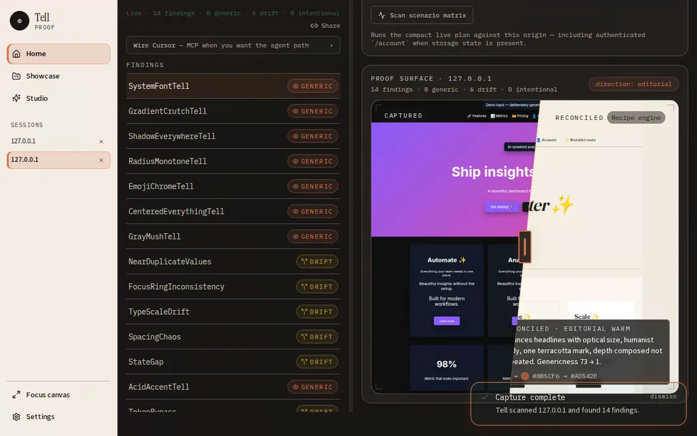](./docs/media/tell-proof-demo.mp4)

<p><a href="./docs/media/tell-proof-demo.mp4">Watch the MP4</a> · ~40s · Report loop + Studio create/redesign + showcases</p>

</div>

---

## Specimens

Tell ships **17 engine offerings** plus Crease and Baseline matchday specimens under [`/showcase`](./apps/web/src/app/showcase). These recaptured stills show current progress: Crease and Baseline matchday, Tiller's session helm, Roundspool's care pathway, Ember Gate's path atlas, and the first-five marketing folds after the Lattice Z-stroke and pipeline-rail fixes.

Each offering appears **once**. We do not stack a fold still and a craft reel of the same page. GitHub shows the reel as that fold's first frame, which made every template look repeated.

| Specimens gallery | Crease · cricket | Baseline · tennis |
|:---:|:---:|:---:|
| [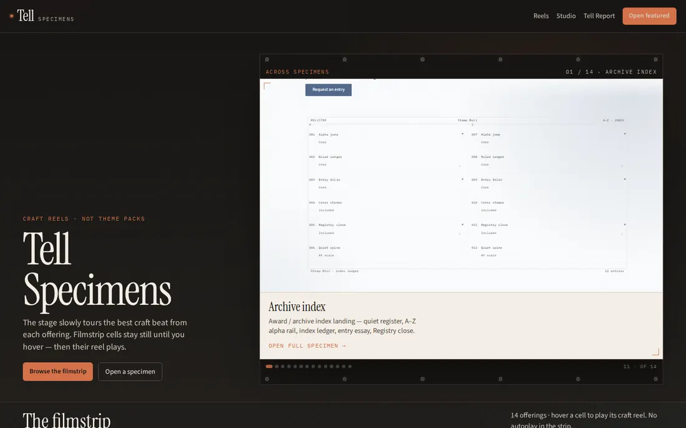](./docs/media/tell-proof-demo.mp4) | 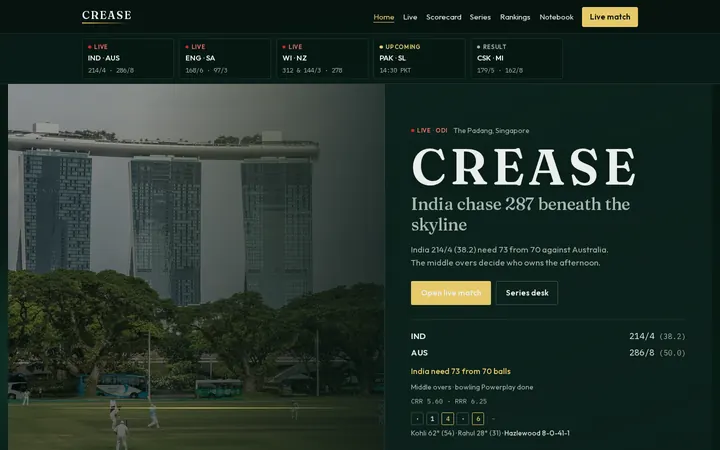 | 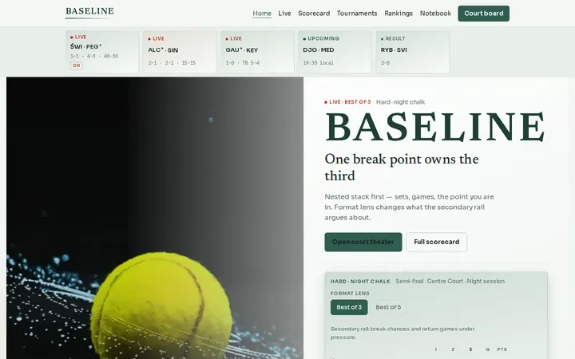 |
| 19 offerings · hover reels on `/showcase` | Live score spine | Nested sets / games / points |

| Agent harness · Tiller | Care pathway · Roundspool | Lantern path · Ember Gate |
|:---:|:---:|:---:|
| 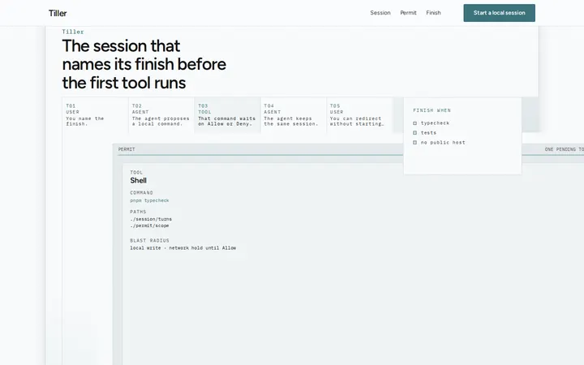 | 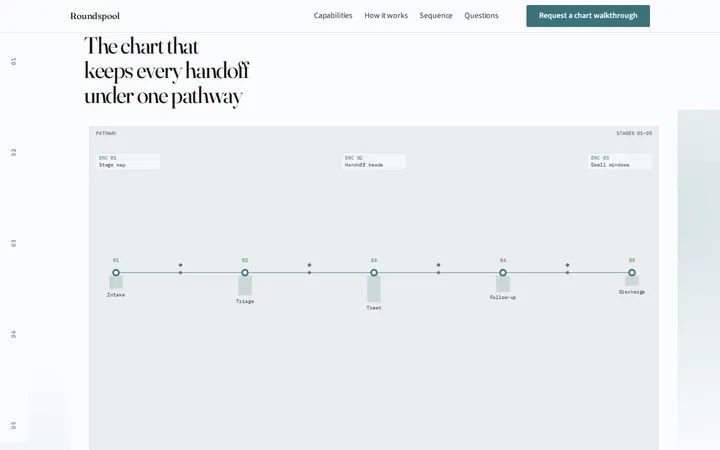 | 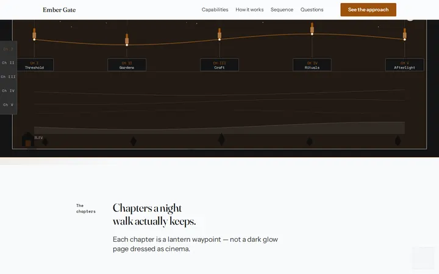 |
| Turn tape + permit plate | Stage rail + care plate | Path atlas, not a broken diagram |

| SaaS · Northstar | Operator console · Queueboard | Trust narrative · Lattice |
|:---:|:---:|:---:|
| 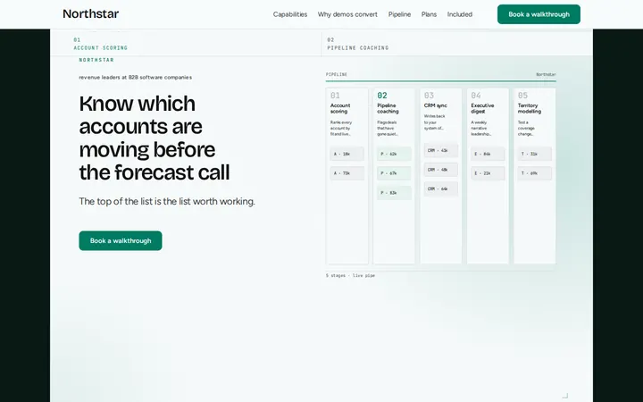 | 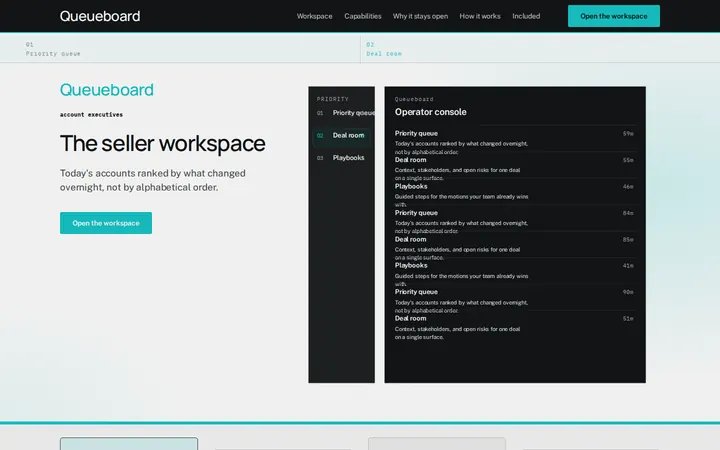 | 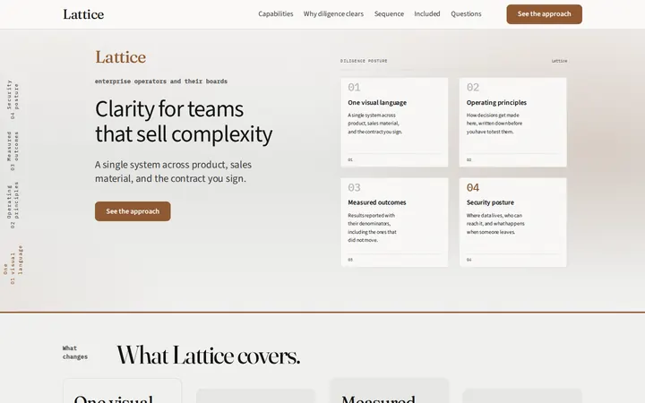 |
| Pipeline board, no title-rail reprint | Priority rail + queue console | Posture grid without a Z-stroke |

| Filmstrip | Press atelier · Forme Desk | Field guide |
|:---:|:---:|:---:|
| 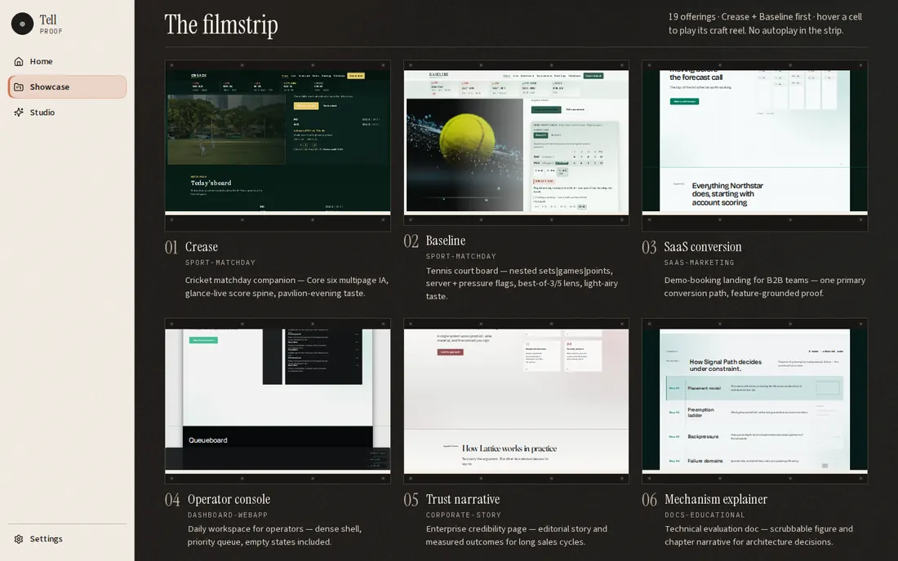 | 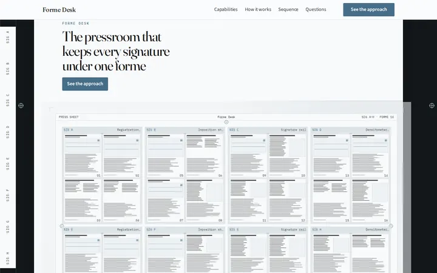 | 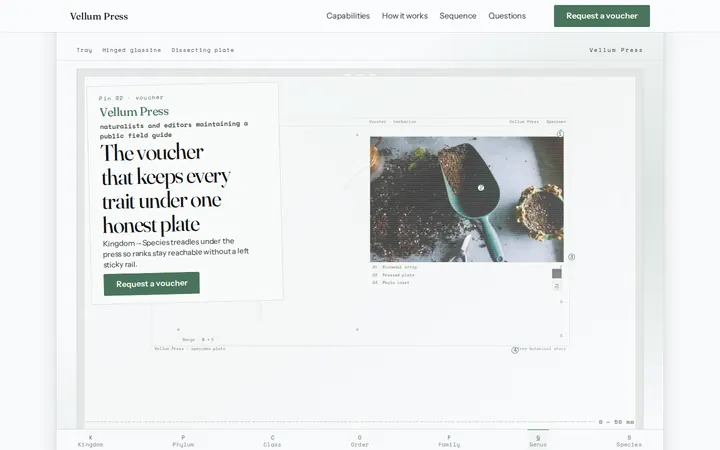 |
| Distinct cells - Crease then Baseline | Imposition sheet + densitometer | Glassine tray |

The poster links the full demo video. Craft reels play on [`/showcase`](./apps/web/src/app/showcase) on hover; this README keeps stills only so GitHub does not reprint the same fold twice.

```bash
pnpm capture:readme-showcase   # one fold still per offering
pnpm capture:readme-steps      # docs/media/step-{capture,detect,art-direct,repair,prove}.webp
pnpm media:webp
```

---

## Why Tell

Coding agents inside Cursor (and other harnesses) are extraordinary at shipping working software. They are much weaker at **visual authorship**. Ask an agent to "make it prettier" and you usually get the same defaults again: system fonts, violet accents, shadow-on-every-card, emoji chrome, monotone radius, mushy gray hierarchy.

That is not a failure of effort. It is a structural gap:

| What the harness optimizes | What production UI actually needs |
|---|---|
| Compiling code that runs | A composition users trust in the first viewport |
| Local file edits that "look better" | Measured contrast, token rhythm, and state coverage |
| The same model judging its own output | An independent visual proof loop |
| Prompt-only taste / one universal layout kit | Kind-specific craft + detectors that cannot be waved away |

**Tell is the missing design runtime for agent-built software.** It sits beside Cursor as an independent critic and craft engine:

1. **Observe** - Playwright captures the rendered page users actually see.
2. **Name** - Fourteen deterministic detectors call out genericness and drift with evidence.
3. **Direct** - Voice/text art-direction becomes concrete action items and a reconciled after-state.
4. **Repair** - Source-ranked diffs land as reviewable patches - never silent auto-apply.
5. **Prove** - Disposable checkouts recapture before/after so the harness can trust the fix.
6. **Author** - Tell Studio turns product features into premium, lean-distinct layouts via a skill graph - so Cursor is not inventing another generic SaaS template from scratch.

The authoring agent proposes. Tell measures, critiques, redesigns, and verifies. Humans stay in control.

### Why this is a higher bar than "generate a pretty page"

| Prompt-only / generic kit | Tell |
|---|---|
| One layout grammar restyled per product | **Nineteen offerings** with distinct fold grammar (press sheet, ledger, lattice, path atlas, session helm, …) |
| Taste lives only in the model's prior | **Deterministic detectors + critique bands** - scores and evidence, not vibes |
| Nav crop as "proof" of craft | **Craft reels** that scroll to plate / spread / imprint beats |
| Filler tiers and lorem sections | **Feature-derived** pricing, proof, and instruments from the brief you typed |
| "Looks better" with no receipt | **Contrast floor, token rhythm, state coverage** reported on the after-state |
| Agent grades its own homework | **Independent capture → diagnose → reconcile → proof** loop beside Cursor |

### How harnesses (especially Cursor) get better

| Harness pain | Tell response |
|---|---|
| Agent grades its own homework | Independent browser capture + scored findings |
| "Make it nice" loops regenerate sameness | Named tells + direction presets with measurable deltas |
| Patches look fine in chat, break in the browser | Disposable proof: apply → HMR → recapture → compare |
| No designer on the team | Studio skill graph + MCP tools inside Agent chat |
| Demo tomorrow, UI still generic | Capture → seam → voice → draft fix → apply in Cursor |

---

## Demo

The recording above walks the full product loop. The stills below are the live Report UI against the fixture at `http://127.0.0.1:3001`.

### 1. Capture

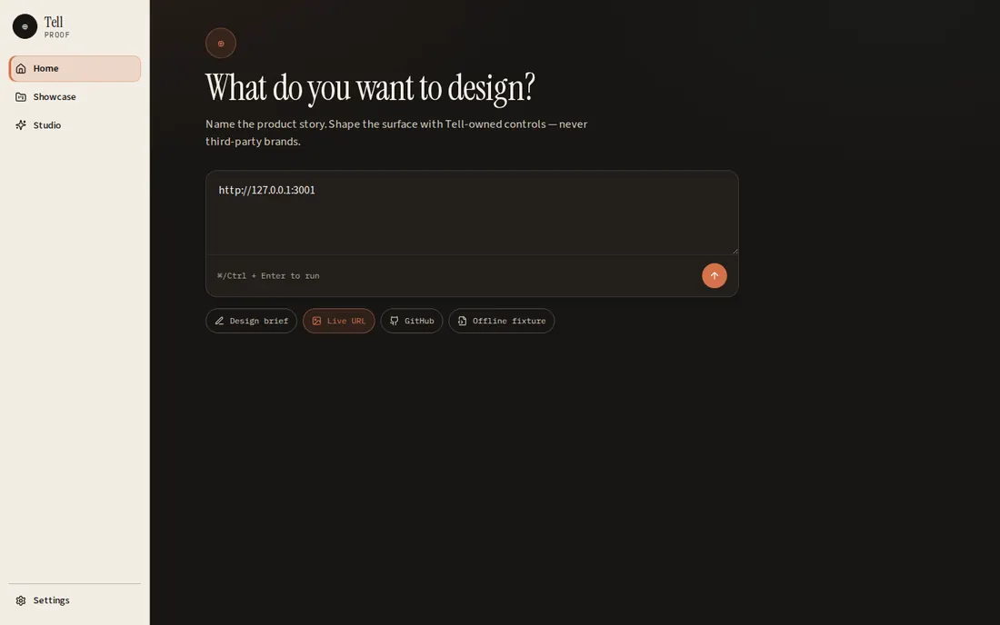

Paste a live URL (or GitHub repo, or the offline fixture). Tell records screenshots, computed styles, CSS variables, and state probes.

### 2. Detect

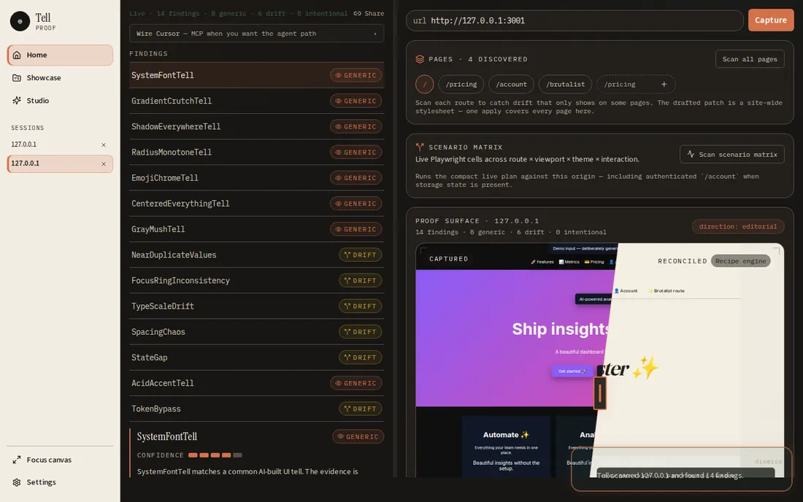

Fourteen deterministic detectors name issues like `SystemFontTell`, radius monotony, shadow overuse, token misuse, and spacing chaos - with evidence on the rendered page.

### 3. Art-Direct

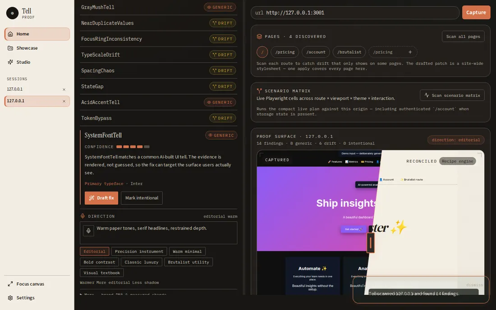

Type or speak a direction ("warmer, more editorial, less shadow"). Tell maps it to a preset and concrete action items.

### 4. Repair

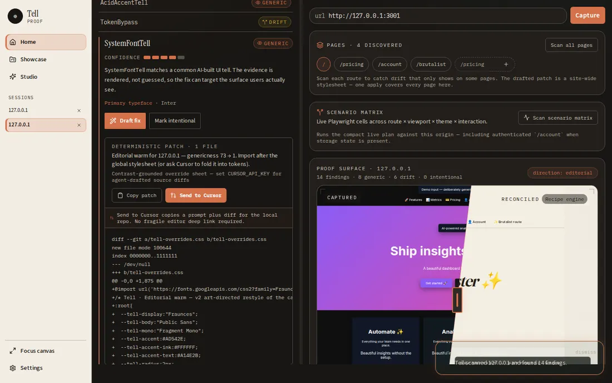

Source-aware diffs update the files responsible for the problem. Copy the patch or send it to Cursor. `tell_apply` never writes files for you.

### 5. Prove

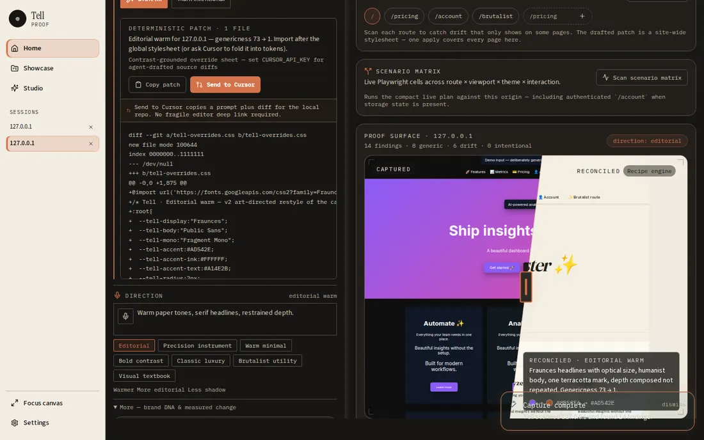

Apply the candidate in a disposable checkout, recapture, and measure improvement (contrast, rhythm, spacing, state coverage) before anything lands.

Studio authoring and plain-language Explain sit on the same engine: generate a premium preview from a feature brief, or read findings with evidence so a human can see what is wrong and why.

Regenerate media locally (web on `:3000`, fixture on `:3001`):

```bash
pnpm record:readme-demo
pnpm capture:readme-showcase
pnpm capture:readme-steps
```

---

## Features

| Capability | What ships today |
|---|---|
| **Rendered capture** | Playwright opens the route and records screenshot evidence, DOM summary, computed styles, CSS variables, contrast samples, and interactive-state probes. |
| **14 deterministic detectors** | 8 genericness tells and 6 consistency-drift detectors catch system fonts, gradient crutches, shadow overuse, radius monotony, gray mush, token bypasses, spacing chaos, state gaps, focus inconsistency, and more. |
| **Taste engine** | Findings become plain-English verdicts: `generic`, `drift`, `intentional`, or `uncertain`, with confidence and rationale. Gemini can enrich judgment; deterministic fallback keeps the flow usable without keys. |
| **Voice and text art-direction** | Say or type directions like "warmer, more editorial, less shadow". Tell maps intent to a preset and concrete action items before model refinement. |
| **Before/after reveal** | The captured page is compared against a deterministic reconciliation that preserves content while improving hierarchy, contrast, depth, radius, and focus treatment. |
| **Tell Studio + design skills** | Feature brief → site-kind routing → tokens → sections → `previewHtml`. Lean codes (`minimal-clean`, `conversion-sharp`, `system-crafted`, `refined-story`) keep layouts distinctive without designer folklore. |
| **Source-grounded redesign diffs** | When a repo is available, Tell ranks real TSX/JSX/CSS files by rendered evidence and drafts a unified diff instead of guessing from a screenshot. |
| **Visual worktree proof** | Candidate patches run inside a disposable checkout. Tell applies, waits for HMR, recaptures, compares score/focus/structure, and auto-reverts failed attempts. |
| **GitHub setup runner** | Paste `github.com/owner/repo`; local Tell clones it, reads `README` and `package.json`, installs dependencies, starts the dev server, and captures the reachable URL. |
| **Multi-page scanning** | Routes discovered from the snapshot can be scanned individually, exposing drift that only appears on pricing, docs, onboarding, or secondary pages. |
| **Cursor MCP** | Eleven `tell_*` tools expose the same engine inside Cursor Agent chat. Catalog matches `@tell/schema` `MCP_TOOL_NAMES`. |
| **Scenario matrix** | Live Playwright capture across route × viewport × theme × interaction × auth (`storageState`), with CI smoke against the fixture and a Tell Report panel. |

Tell is not a replacement for functional, responsive, accessibility, or security testing. It is a focused visual evidence and craft layer - the piece most agent harnesses still skip.

---

## How It Works

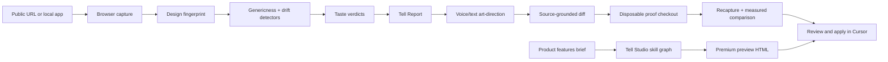
```mermaid
flowchart LR
    url["Public URL or local app"] --> capture["Browser capture"]
    capture --> fingerprint["Design fingerprint"]
    fingerprint --> detectors["Genericness + drift detectors"]
    detectors --> taste["Taste verdicts"]
    taste --> report["Tell Report"]
    report --> direction["Voice/text art-direction"]
    direction --> diff["Source-grounded diff"]
    diff --> proof["Disposable proof checkout"]
    proof --> recapture["Recapture + measured comparison"]
    recapture --> cursor["Review and apply in Cursor"]
    features["Product features brief"] --> studio["Tell Studio skill graph"]
    studio --> preview["Premium preview HTML"]
    preview --> cursor
```

**Deterministic-first:** capture, fingerprinting, detector output, baseline reconciliation, Studio routing/tokens/sections, and score comparison do not depend on a model. Models are only used where judgment or drafting benefits from language.

**Human-reviewed by design:** Tell can prepare a patch and prove it in isolation, but the final change still lands through the developer's normal review workflow.

---

## Quick Start

You need **Node 20+** and **pnpm 9+**.

```bash
git clone <your-repo-url> tell
cd tell
pnpm install
pnpm dev
```

Open [http://localhost:3000](http://localhost:3000) for Tell Report, or [http://localhost:3000/studio](http://localhost:3000/studio) for Tell Studio. The report starts with a demo capture target and falls back to the committed offline report if live capture cannot run.

To use the seeded sample app in a second terminal:

```bash
pnpm dev:fixture   # http://localhost:3001
```

Useful checks:

```bash
pnpm test
pnpm typecheck
pnpm capture:fixture
pnpm diagnose:fixture
pnpm e2e:studio
pnpm capture:readme-showcase
```

---

## Cursor MCP

This repo already registers the Tell MCP server via `.cursor/mcp.json`. Open this repo in Cursor and ask Agent chat to run the tools directly.

```text
Run tell_diagnose on http://localhost:3001 and draft an editorial redesign.
Design a dashboard from these features with tell_design_from_features.
```

```bash
tell mcp install cursor --project   # upsert .cursor/mcp.json
tell mcp platforms                  # compatibility table
tell mcp print-config               # all agent snippets + deeplink
```

| Tool | Purpose |
|---|---|
| `tell_capture` | Capture screenshot and computed-style evidence for a URL. |
| `tell_diagnose` | Return the full Tell report, findings, verdicts, and score. |
| `tell_redesign` | Draft a redesign proposal for a finding or whole report. |
| `tell_apply` | Return patch text and instructions; it never writes files for you. |
| `tell_capture_matrix` | Live Playwright scenario matrix (route × viewport × theme × interaction × auth). |
| `tell_proof_verify` | Apply a patch, recapture the URL, and return pass/review/fail with measured deltas. |
| `tell_proof_revert` | Revert the last proof patch in the workspace. |
| `tell_design_from_features` | Generate a premium layout from a product brief (Studio skill graph). |
| `tell_voice` | Parse a voice/text transcript into a direction plan. |
| `tell_install_info` | Return MCP install snippets, deeplink, and platform catalog. |
| `tell_resolve_intent` | Route a free-text request to diagnose, redesign, or Studio authoring. |

Catalog must stay at **eleven** tools. `tell_apply` returns patch text only.

---

## Platform Compatibility

Tell ships as **skills, a CLI, and an MCP server** that mainstream coding agents consume natively. Once the monorepo is installed, a single `tell mcp install <platform>` wires the MCP server into that agent's config - same tools from inside any host.

| Coding agent / platform | Status | One-line MCP install |
|---|:---:|---|
| Cursor | Supported | `tell mcp install cursor --project` |
| Claude Code | Supported | `tell mcp install claude` |
| Codex CLI | Supported | `tell mcp install codex --project` |
| Grok Build | Supported | `tell mcp install grok --project` |
| OpenCode | Supported | `tell mcp install opencode --project` |
| VS Code + GitHub Copilot | Supported | `tell mcp install vscode --project` |
| Windsurf | Supported | `tell mcp install windsurf --user` |
| Zed | Supported | `tell mcp install zed --project` |
| Cline (VS Code) | Supported | `tell mcp install cline --user` |
| Kiro | Supported | `tell mcp install kiro --project` |
| Kimi Code | Supported | `tell mcp install kimi --project` |
| Qwen Code | Supported | `tell mcp install qwen --project` |
| Pi Agent | Supported | `tell mcp install pi --user` |
| Trae | Supported | `tell mcp install trae --user` |
| Antigravity | Supported | `tell mcp install antigravity --user` |
| Hermes Agent | Supported | `tell mcp install hermes --user` |
| OpenClaw | Supported | `tell mcp install openclaw --user` |
| Muse Code | Snippet | `tell mcp install muse --print` |
| Z Code | Snippet | `tell mcp install zcode --print` |

```bash
tell mcp platforms                          # markdown table
tell mcp install <platform> --print         # dry-run snippet
tell mcp print-config                       # all agent snippets + Cursor deeplink
tell install-info --markdown                # catalog + snippets
```

Tell does **not** spawn third-party coding agents as subprocesses. Compatibility means MCP install into the agent you already use.

---

## Architecture

Tell is a pnpm monorepo with one shared engine behind both the web app and MCP server.

```text
tell/
├── apps/web/              # Next.js product UI and API routes
├── packages/schema/       # Zod contracts shared across every boundary
├── packages/core/         # Capture, fingerprint, detectors, diagnosis
├── packages/taste/        # Verdicts, direction presets, voice/text parsing
├── packages/redesign/     # Reconciliation, source patches, proof measures
├── packages/design-skills/# Feature → route → tokens → sections → preview HTML
├── packages/mcp/          # Cursor MCP stdio server
├── fixtures/              # Generic input app and committed report artifacts
└── docs/                  # Product, deployment, and design notes
```

Key API routes:

| Route | Responsibility |
|---|---|
| `POST /api/diagnose` | Capture and diagnose a URL, using a remote capture backend when configured. |
| `POST /api/redesign` | Produce a source-aware redesign proposal with deterministic fallback. |
| `POST /api/voice` | Convert transcript/text into direction presets and action items. |
| `POST /api/design` | Tell Studio - generate or redesign from a feature brief. |
| `POST /api/setup/start` | Local-only GitHub clone/install/run/capture workflow. |
| `POST /api/proof/apply` | Apply a candidate patch in the disposable checkout and verify it. |
| `POST /api/proof/verify` | Hosted proof sandbox - compare two reports on Vercel, or apply+recapture on the capture backend. |
| `POST /api/proof/matrix` | Live scenario-matrix capture (+ optional self-compare). |
| `POST /api/proof/revert` | Revert the proof checkout. |
| `POST /api/reports/share` | Persist a Tell report (Neon → Blob → disk) and return a shareable `/report/[id]` link. |
| `GET /api/reports/[id]` | Load a previously shared report JSON. |
| `GET /api/health/capture` | Check Playwright capture readiness. |

---

## Deploy

The most reliable production shape is a hosted UI plus a separate Playwright capture backend.

| Layer | Platform | Role |
|---|---|---|
| UI | Vercel | Fast Next.js app, report, reveal, voice direction, Studio, redesign draft |
| Capture | Vultr, Render, or Docker host | Playwright + Chromium for live URL diagnosis |
| MCP | Local Cursor | Stdio tools for editor-native diagnosis and patch handoff |

Set `TELL_CAPTURE_API_URL` on the Vercel app to point at the capture backend. GitHub clone-and-run is local-only and should stay disabled on public hosts with `TELL_DISABLE_REPO_SETUP=1`.

For durable share links on Vercel, set `DATABASE_URL` from a Neon project (preferred) or link a Blob store (see [DEPLOY.md](./docs/DEPLOY.md)). For PR preview diagnosis CI, set the GitHub repo variable `TELL_PREVIEW_URL` to your stable Vercel URL.

Deployment guides:

- [Hybrid and single-platform deploy](./docs/DEPLOY.md)
- [Vultr capture backend](./docs/DEPLOY-VULTR.md)

---

## Contributing

Contributions are welcome. The highest-leverage additions are new detectors, stronger Studio skills, better evidence views, and tighter source mapping for harness workflows.

```bash
pnpm typecheck && pnpm test
```

The sample app under `fixtures/generic-app/` is intentionally bland input data, not the product itself. See [CONTRIBUTIONS.md](./CONTRIBUTIONS.md) for the attribution breakdown.

---

## License

Released under the [MIT License](./LICENSE).
