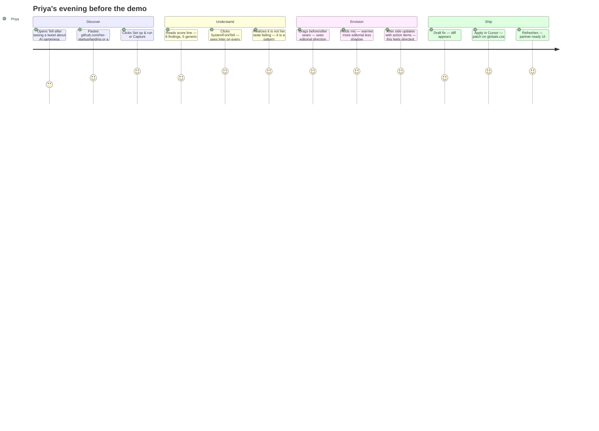

# User Story — Tell

> Judges should feel Priya's problem before they see the pipeline. Lead demos with her journey.

---

## Persona: Priya Chen

| | |
|---|---|
| **Who** | Solo founder, technical, ships with Cursor daily |
| **Built** | B2B SaaS MVP in one weekend using Cursor Agent |
| **Problem** | Landing page works but looks like every other AI-built product |
| **Stakes** | Investor demo tomorrow; embarrassed to share the URL |
| **Constraint** | No designer, no time for a full rebrand, can't afford to break what works |
| **Goal** | Distinctive, trustworthy UI she can art-direct herself — inside Cursor |

---

## Before Tell (the pain)

Priya's internal monologue:

> "I shipped this in a weekend. Why does it look exactly like the last three products I bookmarked on Product Hunt? Inter font, purple gradient, shadow on every card, emoji in the nav. I *know* something is wrong but I can't name it. ChatGPT says 'add more whitespace.' That's not a direction."

**What she tries today (and why it fails):**

| Approach | Why it fails |
|---|---|
| Ask Cursor Agent to "make it prettier" | Agent picks the same defaults — another violet gradient |
| Figma token diff tools | She never had Figma tokens; she vibe-coded in Cursor |
| Hire a designer for a day | $800 and 2-week queue; demo is tomorrow |
| Copy a Dribbble shot | Looks pasted-on; breaks her component structure |

---

## User journey (the product flow)

---

## Scene-by-scene (demo copy)

### Scene 1 — Empty state
**Priya sees:** `No capture yet.` / `Paste your app URL — Tell reads what users actually see.`
**Feels:** Low friction; not another dev tool dashboard.

### Scene 2 — Capture
**Priya sees:** Progress readout `Launching headless browser…` then `Capture complete.` — or, for a GitHub repo, a setup panel: Cloning → Installing → Waiting for reachable URL → Running → auto-capture. The old preview is hidden while setup/capture is in progress, and failures say what URL could not be reached.
**Feels:** Tell is looking at the *real* product, not her repo structure. She knows when the app is working, when it failed, and what to do next.

### Scene 2b — Multi-page (optional beat)
**Priya sees:** Pages strip with `/`, `/pricing`, `/about` discovered from her snapshot. She scans `/pricing` and finds a drift finding that only shows there.
**Feels:** Tell catches inconsistency across the surface, not just the hero.

### Scene 3 — The tell (emotional beat)
**Priya sees:** `SystemFontTell · GENERIC` — *"Inter appears on every text role with no display face. This is the default AI type stack, not a considered choice."*
**Feels:** Named the shame. Evidence on screenshot with proof-mark pin.

### Scene 4 — Taste (credibility beat)
**Priya sees:** A brutalist section marked `INTENTIONAL` — *"Single-family mono is a documented choice on this route."*
**Feels:** Tell has taste, not lint rules.

### Scene 5 — Before/after (the aha)
**Priya drags the seam.** Left: her captured page as it actually renders. Right: the same page with reconciled tokens — type hierarchy, accent, radius, depth, focus ring, and contrast floor — grounded in what Tell measured.
**Feels:** "This is a direction I can defend" — not a random reskin.

### Scene 6 — Voice art-direction
**Priya says:** "Warmer, more editorial, less shadow."
**Priya sees:** Tell breaks that into action items and maps it to a direction preset before any model refinement.
**Feels:** Art-directing like a creative director, not writing CSS.

### Scene 7 — Reconcile in Cursor
**Priya clicks:** `Apply in Cursor` → patch copied → Agent applies → refresh.
**Feels:** Closed loop. Still in her workflow. No export, no handoff.

---

## Success metrics (user-centric)

| Metric | Target |
|---|---|
| Time to first finding | < 10s on fixture |
| "Named my problem" moment | SystemFontTell or GradientCrutchTell with evidence |
| "Saw a future" moment | Seam drag before/after |
| "This is grounded" moment | Contrast floor and token changes visible in reconciliation table |
| "Shipped the fix" moment | Diff applied in Cursor without leaving IDE |
| Emotional outcome | Priya would share Tell in Cursor Discord |

---

## What Tell is NOT (for judges)

- Not a codebase mind-map (crowded space)
- Not a Figma token differ (saturated space)
- Not a dashboard of KPIs (disqualifying pattern)
- Not auto-apply without human review

---

## Copy bank (use in UI)

| Context | Copy |
|---|---|
| Hero | Every AI-built UI has a tell. |
| Subhead | Capture your product, name what's generic, art-direct a direction, apply the fix in Cursor. |
| Empty CTA | Capture my app |
| Finding rationale tone | Direct, specific, no apology — senior designer note |
| Voice placeholder | Describe the direction — warmer, editorial, less shadow… |
| Dogfood line | Tell runs on itself: zero tells. |
| Priya quote (landing) | "I couldn't name what was wrong. Tell showed me in thirty seconds." |

---

## Secondary persona (stretch)

**Marcus** — design engineer at a startup. Uses Tell in Cursor MCP during PR review: *"tell_diagnose this preview URL before merge."* Same engine, different entry point. MCP is the power-user path; the web UI is the emotional demo path.
