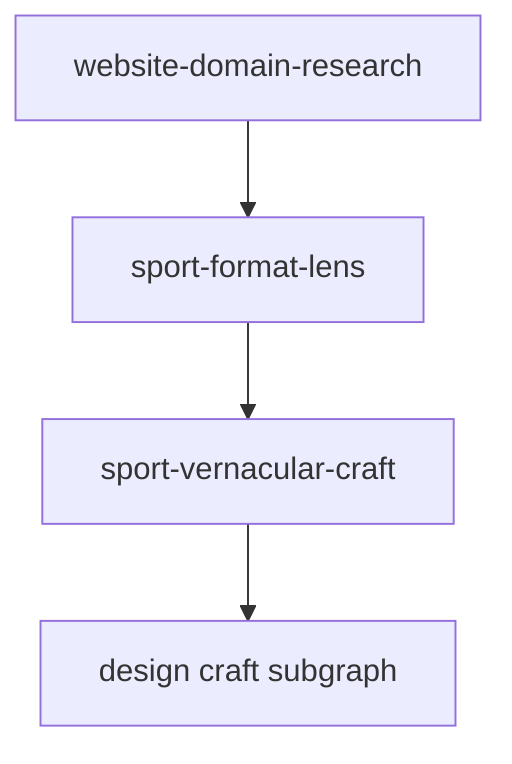

# sport-matchday-web — GRAPH

**extends:** `website-domain-research`

## Research (inherited)

`load-prior-domain` → `requirement-gap-diff` → (`multipage-walkthrough` | skip) → `category-gap-audit` → `ia-shell-synthesis` → `variant-lens` → `emit-training-episode`

## Sport specialization

- `sport-format-lens` — after or instead of generic `variant-lens` when `sportId` is set
- Design nodes authored in later phases; Phase 0 fills DomainResearchPack evidence

## First consumer

CREASE cricket specimen — Core six routes under `/crease/*`.
BASELINE tennis specimen — Core six routes under `/baseline/*` (nested sets|games|points).
