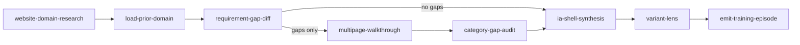

# website-domain-research — GRAPH

Domain-agnostic research graph. Edges are sequential gates; do not skip LoadPrior or training emit.

## Specializations

| Parent | Extends | Adds |
|---|---|---|
| `sport-matchday-web` | this graph | format lens + score-spine / live-rail / scorecard / … design nodes |
| `premium-content-custom-web` | invokes this first | existing craft nodes after research |

## Phase routing

| Phase | Nodes |
|---|---|
| Any new website brief | LPD → RGD → (MPW→CGA)? → IAS → VL → ETE |
| Same domain, customize only | LPD → RGD → IAS (light) → ETE |
| New domain | Full walkthrough + new DomainResearchPack |

## Engine

- `loadPriorDomain(domainId)`
- `requirementGapDiff(pack, requirement)`
- `routeDomainResearchSkills(brief)`
- Capture: `pnpm exec tsx scripts/multipage-domain-capture.ts`
- Training: `scripts/emit-design-training-episode.ts`
