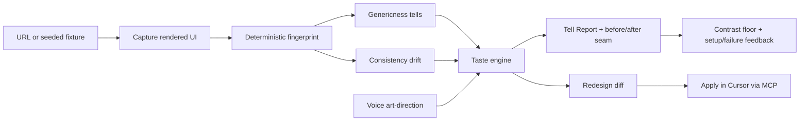

# Tell — Claude Project Master Document

> This is the brain of the build. It goes into a **Claude Project** as knowledge, alongside the
> other three documents. It carries the vision, the requirements, the scope, the plan, the demo,
> the risks, the rules-compliance checklist, and a live tracker. §14 is a copy-paste block for the
> Project's **Custom Instructions**.

Project: **Tell** · Track: **Cursor** · Format: 2-day build sprint · Repo: _public, TBD_

---

## 1. How to set up the Claude Project

**Project Knowledge (upload all four):**
- `01_DESIGN_SYSTEM.md` — visual + interaction contract
- `02_CURSOR_BUILD_INSTRUCTIONS.md` — engineering spec
- `03_CLAUDE_DESIGN_BRIEF.md` — art direction + Design prompts
- `04_CLAUDE_PROJECT.md` — this file (vision, scope, tracking)

**Project Custom Instructions:** paste §14.

**Working rhythm:** ask this Project for planning, copy, detector logic, prompt engineering, and
tracking. Use Cursor + Claude Code for the actual code, following `02_*`. Use Claude Design for
screens, following `03_*`. Keep §12 (the tracker) updated at each milestone — paste your current
status and ask for the next move.

---

## 2. One-line pitch

**Every AI-built UI has a tell.** Tell captures your product's *real rendered* UI, names the tells
that make it read as AI-generated, catches consistency drift across its surface, and — steered by
your voice — proposes a distinctive art direction, drafting the redesign as a diff you apply in
Cursor.

## 3. Vision

AI has made it trivial to ship software — and equally trivial to ship software that all looks like
the same product. Inter everywhere. One violet gradient. Shadow on every card. Eight-pixel radius on
everything. The result isn't ugly; it's *forgettable*. Worse, as teams and agents iterate, the
surface drifts: six near-identical grays, focus rings half the library relies on the browser for,
empty states someone forgot. The old Cursor track asked for a system with "enough taste to know when
something is wrong" across a product's visual *and interactive* surface. The updated track asks for
a real human problem solved through exceptional design, art, interactivity, and voice. Tell is both:
a taste critic that reads the *rendered* truth of your UI, distinguishes a generic tell from a
defensible choice, and closes the loop to a distinctive redesign — inside Cursor.

The end state: software you can trust an agent to extend, because something with taste is watching
the surface — and can name what's wrong in plain language, show you the before/after, and draft the
fix.

## 4. Why now (grounded)

- **Agentic coding creates a "sameness tax."** Cursor, v0, Bolt, and every AI builder converge on
  the same visual defaults. The industry joke — "you can tell it was built with AI" — is now a
  product problem, not a meme.
- **Static token-diffing is saturated** (designlang, Atomize, Token Auditor, Firebender, Figma's
  checker). Nobody guards the *rendered* surface — what users actually see — nor assesses whether
  divergence is generic vs intentional.
- **Codebase-viz + voice onboarding is crowded** (CodeMap, Codelore, Understand-Anything, Nexo,
  GENIE). We do not compete there. Tell reads *design*, not architecture.
- **"Taste" is the named missing layer** in the original Cursor statement. Models wire up UI and
  still make bland, inconsistent choices. The hard part is knowing when something is *wrong* — and
  showing a better direction. That is precisely what wins the track.
- **The updated statement rewards the journey.** Voice art-direction, a before/after reveal, and a
  product that visibly practices what it preaches (Tell's own UI passes its own audit) score on
  design, art, and interactivity — not just engineering depth.

## 5. Problem statement (the wedge — both statements)

**Original Cursor statement:** Static design tokens and component libraries are brittle contracts.
Build an AI-native design system that reasons about consistency across a product's visual and
interactive surface — detecting drift, proposing reconciliation, and keeping designers and engineers
aligned. The question is whether the system has enough *taste* to know when something is wrong.

**Updated Cursor statement:** Solve a real day-to-day problem through a better interactive
experience — thoughtful user journey, design, art, interactivity (video, voice). Thought starters
include "the redesign your product has needed for a year."

**Tell's wedge:** Most teams will diff Figma tokens (crowded) or build another codebase mind-map
(crowded). Tell takes the intersection nobody owns: **capture the real rendered UI → name the
genericness tells → catch consistency drift → reason with taste (bug vs choice) → voice art-direct
a distinctive direction → draft the redesign in Cursor.** The felt problem is universal: "My product
looks like every other AI-built thing, and I don't know how to fix it without a designer for a
month."

## 6. Target & success criteria

**Primary target:** win the Cursor track.

**Demo-facing success:**
- The demo shows a real capture → diagnose → art-direct → contrast-grounded reconcile loop, runnable from Cursor via MCP.
- The taste layer visibly distinguishes a generic tell from an intentional design choice, with a reason.
- The **before/after seam reveal** lands — the "aha" is visual, not a spreadsheet.
- Voice art-direction changes the proposed direction and re-renders (with text fallback for safety).
- The after-state explains measurable improvements: contrast floor, focus coverage, radius/depth consistency, and accent harmonization.
- The dogfood beat: **Tell runs on itself: 0 tells.**

**Measurable demo outcomes:** 8+ planted findings on the seeded generic fixture (4 tells + 4 drifts),
≥6 correct verdicts, ≥1 correctly marked `intentional`, ≥1 voice-driven direction change, ≥1
draftable redesign diff, < 5s capture+diagnose on the fixture (excluding model latency),
reproducible across runs.

## 7. Requirements

**Functional**
- FR1 Capture a URL or local route via Playwright/CDP: full-page screenshot + computed-style
  fingerprint (fonts, colors, shadows, radii, spacing, contrast, interactive-state probes).
- FR2 Produce a deterministic design fingerprint (pure, no LLM).
- FR3 Detect genericness tells via eight deterministic detectors (SystemFontTell, GradientCrutchTell,
  ShadowEverywhereTell, RadiusMonotoneTell, AcidAccentTell, EmojiChromeTell, CenteredEverythingTell,
  GrayMushTell).
- FR4 Detect consistency drift via six deterministic detectors (TokenBypass, NearDuplicateValues,
  FocusRingInconsistency, TypeScaleDrift, SpacingChaos, StateGap).
- FR5 Classify each finding with a taste verdict (`generic` / `drift` / `intentional`) + rationale
  + confidence, grounded on deterministic facts, with a reflection/validate pass.
- FR6 Accept voice (or text preset) art-direction, split compound direction into action items, and re-propose a redesign direction + token/CSS diff.
- FR7 Draft a reconciliation diff for a chosen finding or full redesign; never auto-apply; preserve readable foreground/background pairings.
- FR8 Expose capture/diagnose/redesign/apply as MCP tools callable from Cursor.
- FR9 Render a Tell Report (findings list + before/after seam + diff viewer + voice director).
- FR10 Produce a scannable report artifact (the Tell score).
- FR11 Paste a public GitHub repo, run it locally when trusted, verify a reachable localhost URL, and auto-capture it with visible setup/failure states.

**Non-functional**
- NFR1 Deterministic core: capture normalization + fingerprint + detection have zero LLM/network
  dependence.
- NFR2 Reproducible demo: seeded generic fixture, committed report artifact as offline fallback.
- NFR3 Schema-validated boundaries (zod) everywhere.
- NFR4 Accessibility floor met by the app itself and by proposed after-states (WCAG AA contrast targets,
  focus-visible, non-color verdict encoding, reduced-motion).
- NFR5 Public repo, legible original-work attribution.
- NFR6 Tell's own UI must pass its own audit (dogfood contract).

## 8. Architecture (summary; details in `02_*`)

Monorepo: `schema` (contracts) → `core` (capture + fingerprint + detectors, pure) → `taste`
(Gemini reasoning + deterministic/Gemini direction parsing) → `redesign` (contrast-grounded reconciliation + diff gen) → `mcp`
(Cursor-facing tools) → `apps/web` (Next.js + Tell Report + before/after seam + voice director).
`fixtures/generic-app` is the deliberately bland demo target; `fixtures/reports` holds the committed
offline artifact.

Pipeline: **capture → fingerprint → detect (tells + drift) → reason (taste) → art-direct (voice) →
reconcile**, shared by both the MCP server and the web app.



## 9. Competitive landscape (position, don't repeat)

- **Static token drift** (designlang, Atomize, Token Auditor, Firebender): solved/crowded. We do not
  compete here.
- **AI site builders** (v0, Bolt, Lovable): generate generic UI; they don't *diagnose* or *critique*
  existing surfaces with taste.
- **Codebase visualization + voice** (CodeMap, Codelore, Understand-Anything, Nexo, GENIE): read
  architecture, not design. Crowded; not our lane.
- **Visual regression** (Chromatic, Percy): pixel diffs without judgment — no "this is generic" or
  "this is intentional."
- **Design-context-for-agents** (skills, DESIGN.md): feeds rules *to* agents; does not *detect*
  rendered genericness or reviewer drift on the live surface.

Tell's defensible slice: **rendered-surface genericness detection + consistency drift + taste verdicts
+ voice art-direction + measurable reconciliation, in Cursor.** No shipped product occupies it.

## 10. Scope

**MVP spine (must ship):** FR1–FR5, FR8 (capture+diagnose), FR9 (Tell Report + before/after seam +
inspector), FR10 (score artifact).

**Stretch now shipped:** FR6–FR7 (voice/text art-direction + full reconciliation diff + Apply in
Cursor); live URL capture; GitHub repo setup with reachable localhost verification; multi-page route
scanning.

**Stretch now also shipped:** Playwright state-probe thumbnails; shareable report links (`/api/reports/share`).

**Remaining (see root `PLAN.md`):** optional corpus expansion and scenario matrix — MVP through Phase 4 is complete.

**Explicit cut line:** if live repo setup breaks at demo time, keep the committed fixture artifact and
seeded fixture path. Do not show a broken or unreachable localhost state as success; Tell must either
capture live, show a manual URL fallback, or clearly explain the failure.

**Out of scope:** databases, auth, multi-framework source parsing, Figma integration, team settings,
mobile native app (web + MCP is the surface).

## 11. Two-day execution plan

Milestones M1–M10 with Definition of Done are specified in `02_CURSOR_BUILD_INSTRUCTIONS.md §8`.
Day 1 = spine (schema, capture, fingerprint, detectors, taste, MCP diagnose). Day 2 = wow + loop
(Tell Report, before/after seam, voice director, redesign diff, hardening, dogfood). Keep the tracker
(§12) in lockstep with those milestones.

## 12. Live tracker (update this in the Project)

**Status legend:** ⬜ todo · 🟡 in progress · ✅ done · ⛔ blocked · ✂️ cut

| ID | Milestone | Status | Owner | DoD met? | Notes |
|----|-----------|--------|-------|----------|-------|
| M1 | schema (zod contracts) | ✅ | | yes | |
| M2 | capture + fingerprint (Playwright → Fingerprint) | ✅ | | yes | committed `capture.json` |
| M3 | 14 detectors → planted findings on generic fixture | ✅ | | yes | golden findings on fixture |
| M4 | taste engine + reflection + fallback | ✅ | | yes | Gemini + deterministic fallback |
| M5 | MCP capture + diagnose (Cursor) | ✅ | | yes | + proof verify/revert tools |
| M6 | Tell Report + before/after seam | ✅ | | yes | live reconcile CSS |
| M7 | Tell/Drift inspector + verdict cards | ✅ | | yes | |
| M8 | voice director + redesign diff (stretch) | ✅ | | yes | redesign v2 recipes + LLM path |
| M9 | demo hardening + backup video | ✅ | | yes | offline artifact + demo gif |
| M10 | dogfood: 0 tells on own repo | ✅ | | yes | `pnpm dogfood:web` |
| P3 | viewport matrix + proof verify API + corpus | ✅ | | yes | see PLAN.md |
| P4 | taxonomy + corpus + PR proof automation | ✅ | | yes | see PLAN.md |

**Status log (append newest on top):**
```
[2026-07-17] Consolidated PLAN.md; archived docs/02 + redesign-v2 spec; Phase 3–4 closed.
[Day _ · HH:MM] <what changed> · <next action> · <blockers>
```

## 13. Risks & mitigations

- **Model nondeterminism breaks the demo.** → Deterministic core; commit a full report artifact;
  seed the before/after; run the live model path behind a timeout that falls back to the artifact.
- **Scope creep (live URL, full redesign, voice).** → Enforce the cut line; treat them as stretch.
- **Playwright capture is flaky in demo.** → Primary demo uses the seeded fixture + committed
  artifact; live URL is the flex beat, not the spine.
- **Taste engine over-flags / hallucinates.** → Pass deterministic facts as authoritative; reject
  rationales that contradict facts; fall back to mechanical verdict at confidence 0.5.
- **Rules disqualification (attribution).** → `CONTRIBUTIONS.md` clearly separates our work from the
  seeded generic fixture; commits timestamped in-event; public repo.
- **"It's just a dashboard" objection.** → The feature is the capture→diagnose→art-direct→reconcile
  loop; the report explains the agent. Lead the demo with the loop and the before/after seam, not a
  grid of KPI cards.
- **Tell's own UI triggers its detectors.** → Design to the dogfood contract in `01_*`; run Tell on
  itself before demo; fix any real findings.

## 14. Custom Instructions for this Claude Project (paste into the Project settings)

```
You are the build partner for Tell, an AI taste critic for the Cursor-native product track. Your job is
to help ship a winning 2-day build.

Context you always assume:
- Tell captures a product's REAL RENDERED UI (Playwright/CDP), builds a deterministic design
  fingerprint, detects genericness tells + consistency drift, reasons WITH TASTE about generic vs
  drift vs intentional, accepts voice art-direction, and drafts measurable redesign diffs callable
  from Cursor via MCP.
- We do NOT build static token-diffing (saturated) or codebase mind-maps (crowded). Our slice is
  rendered-surface taste + voice art-direction + reconciliation.
- Stack: TypeScript, Playwright, Next.js 14, Tailwind, Gemini for taste/voice refinement,
  Cursor SDK for agentic draft enhancement, deterministic reconciliation, MCP (stdio), zod, vitest,
  pnpm workspaces.
- The four project docs are authoritative: design system, Cursor build instructions, Claude Design
  brief, and this master doc. When they conflict, the design system wins on visuals, the Cursor doc
  wins on engineering.

How to help:
- Keep the deterministic core (capture + fingerprint + detection + reconciliation) free of
  LLM/network calls. LLM/agent calls are only for taste verdicts, optional voice refinement, and
  optional patch enhancement with deterministic fallback.
- Enforce the build order and Definition of Done from the Cursor doc §8. Protect the cut line.
- Tell's own UI must pass its own audit — editorial/print-atelier aesthetic, no Inter-only, no
  violet gradient hero, no shadow-on-everything. Dogfood the product.
- Default to concrete deliverables: zod schemas, detector logic, prompt contracts, copy in the
  critic voice (precise, direct, sentence case, no apology, no emoji).
- When I paste the tracker, tell me the single most important next action and what to cut if I'm
  behind.
- Keep everything reproducible for the live demo; prefer the committed report artifact as fallback.
- Watch the project originality rules: public repo, original-work attribution, and stay clear of the banned
  "dashboard as the main feature" framing — the loop is the product, the report serves it.
```

## 15. Demo script (5 beats, ~3 minutes)

1. **Setup (20s).** Open the seeded generic app. "Shipped in a day with AI. Looks… familiar."
2. **Capture + diagnose (30s).** Paste URL / hit Capture in Tell (or invoke `tell_diagnose` MCP).
   Report loads: `8 findings · 5 generic · 2 drift · 1 intentional`.
3. **Taste (50s).** Click `SystemFontTell` → verdict + rationale: Inter on every text role, no
   display face — generic. Then click a finding on a deliberately mono-everything section → verdict
   `intentional`: "Single-family type is a documented brutalist choice." "It knows generic from
   intentional."
4. **Before/after (40s).** Drag the reveal seam. Left: the bland fixture. Right: Tell's proposed
   editorial direction with contrast floor and token rows visible. "This is a direction you can
   defend, not a random reskin."
5. **Voice + reconcile (40s).** Hold mic: "Warmer, more editorial, less shadow." Action items appear;
   direction updates; diff appears → `Apply in Cursor`. Close: "Tell runs on itself: zero tells."

Have a recorded backup of the exact run in case of live failure.

## 16. Rules-compliance checklist

- [ ] Repo is public and open source.
- [ ] Team size within limits (remote 1–5).
- [ ] Demo highlights only what we built in-event; `CONTRIBUTIONS.md` separates our work from the
      seeded generic fixture.
- [ ] No presenting prior work as new; the fixture is clearly labeled as demo input, not our
      contribution.
- [ ] Not a banned project type: not a basic RAG app, not an image analyzer, and the Tell Report is
      not a dashboard — the capture→diagnose→art-direct→reconcile loop is the product.
- [ ] Uses only assets/code we have rights to (fixture is appropriately licensed and attributed).
- [ ] Builds in the Cursor track — both the original taste/consistency statement and the updated
      design/journey/voice statement.

## 17. Glossary

- **Fingerprint** — deterministic snapshot of a rendered UI's computed design properties.
- **Tell** — a detected genericness pattern (e.g. Inter everywhere, violet gradient crutch).
- **Drift** — a consistency fracture across the rendered surface (e.g. six near-identical grays).
- **Verdict** — the taste engine's classification: generic / drift / intentional.
- **Reveal seam** — the signature visual: a diagonal wipe from "before" to "after."
- **Dogfood** — running Tell on Tell's own UI; target is zero tells.
- **Art direction** — the voice- or preset-driven target aesthetic for the redesign proposal.

## 18. How the four documents relate

```
04_CLAUDE_PROJECT.md   → vision, scope, requirements, tracking, demo, rules   (the WHY + WHAT)
   ├─ 01_DESIGN_SYSTEM.md         → visual + interaction contract              (the LOOK + FEEL)
   ├─ 02_CURSOR_BUILD_INSTRUCTIONS.md → engineering spec + build order         (the HOW to build)
   └─ 03_CLAUDE_DESIGN_BRIEF.md   → screens + art direction + Design prompts   (the HOW it looks)
```

Start here (04) for orientation, build with 02, design with 03, and hold everything to 01.
